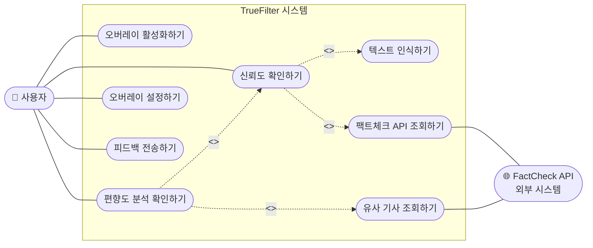
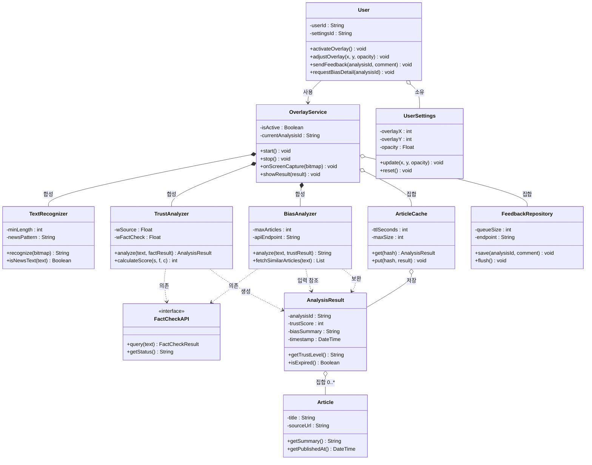
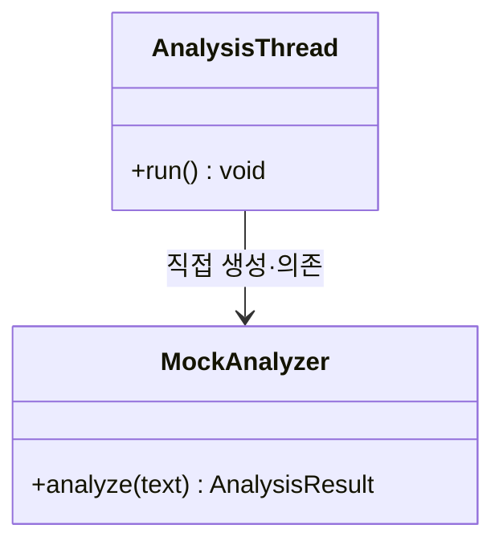
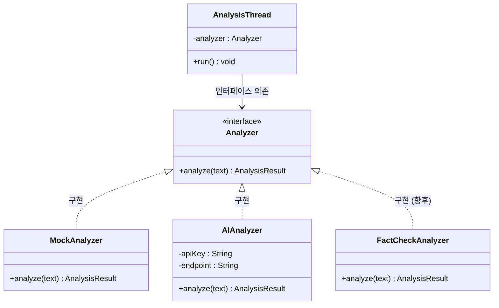

# M3 최종보고서 — TrueFilter

`#SW공학` `#PBL` `#M3` `#최종보고서`

---

## 표지

| 항목 | 내용 |
|------|------|
| 프로젝트명 | TrueFilter — SNS·뉴스 신뢰도/편향도 실시간 오버레이 분석 시스템 |
| 팀명 | TrueFilter (C조) |
| 과목명 | 소프트웨어개론 |
| 담당 교수 | 김대성 |
| 제출 마일스톤 | M3 최종 보고서 |
| GitHub | <https://github.com/raysheny0630/sw-c-team> |

### 팀원 목록

| 이름 | 역할 | 주요 담당 항목 |
|------|------|----------------|
| 김지우 | PM | 1·2·3·4·5·13 |
| 정주승 | 분석가 | 3·5 |
| 최라혜 | 설계자 | 7·8·9 |
| 박정우 | 개발자 | 6·8·11 |
| 주민찬 | QA/보안 | 10·12 |
---

## 목차

1. [프로젝트 개요](#1-프로젝트-개요)
2. [팀 구성 및 역할분담](#2-팀-구성-및-역할분담)
3. [요구사항 정의서 (최종본)](#3-요구사항-정의서-최종본)
4. [WBS 및 프로젝트 일정 (계획 + 실적)](#4-wbs-및-프로젝트-일정-계획--실적)
5. [비용 산정 결과](#5-비용-산정-결과)
6. [협업 도구 운영 방식](#6-협업-도구-운영-방식)
7. [UML 다이어그램 (최종본)](#7-uml-다이어그램-최종본)
8. [설계 패턴 적용 내역](#8-설계-패턴-적용-내역)
9. [SOLID 원칙 검토](#9-solid-원칙-검토)
10. [인스펙션 결과 (팀 내 Cross-check)](#10-인스펙션-결과-팀-내-cross-check)
11. [코딩 표준 문서](#11-코딩-표준-문서)
12. [AI 활용 내역 요약](#12-ai-활용-내역-요약)
13. [회고 및 개선 사항](#13-회고-및-개선-사항)

---

## 1. 프로젝트 개요

> 주 작성자: PM 

**프로젝트명**

TrueFilter

**배경 및 문제 정의**

SNS·인터넷 뉴스 사용 중 알고리즘이 자극적이고 왜곡된 기사만 반복 노출시키는 문제를 체감하였다. 페르소나 인터뷰(단국이, 20세)에서 "잘못된 정보를 사실인 줄 알고 얘기했다가 민망했다", "따로 검증하는 작업은 번거로우므로 잘 하지 않는다"는 답변을 얻어, **검증의 번거로움 자체를 제거하는 도구**가 필요하다고 정의하였다.

**목적**

SNS 피드·뉴스를 보는 도중 앱(화면)을 전환하지 않고도 **오버레이 방식**으로 신뢰도·편향도 분석 결과를 즉시 확인할 수 있게 하여, 사용자가 스스로 정보를 판단할 수 있도록 돕는다. AI 인터뷰에서 "판단해주는 느낌이면 거부감이 들 것 같다, 근거를 같이 보여주면 신뢰할 것"이라는 피드백을 받았으므로, 점수만 제시하지 않고 근거(출처 공신력·유사 기사·팩트체크 결과)를 함께 제공한다.

**예상 사용자**

SNS·인터넷 뉴스에서 시사 정보를 주로 접하는 일반 사용자 (제품 비전: Android/iOS / 프로토타입: Windows)

**주요 기능 요약**

| # | 기능명 | 설명 |
|---|--------|------|
| 1 | 화면 텍스트 인식 | 화면에 표시된 뉴스 텍스트를 캡처·OCR로 인식 (프로토타입: `Ctrl+Shift+F` 단축키 트리거 + Tesseract OCR) |
| 2 | 신뢰도 5단계 산출 | 인식된 텍스트의 신뢰도 점수(0~100)를 산출하여 5단계 게이지로 표시 |
| 3 | 편향도 요약 + 유사 기사 | 편향도를 1문장으로 요약하고, 요청 시 유사 기사 리스트(최대 5건) 제공 |
| 4 | 오버레이 사용자 조절 | 오버레이 창 위치(드래그)·투명도(슬라이더) 직접 조절 |
| 5 | 오분석 피드백 전송 | 잘못된 분석 결과에 대한 수정 요청 피드백 전송 |

**M1 대비 변경 사항**

| 변경일 | 변경 내용 | 변경 사유 |
|--------|-----------|-----------|
| 2026-05-18 | 프로토타입 타겟 플랫폼을 모바일(Android/iOS)에서 **Windows**로 변경 | 교수님 요청 프로토타입 제작에 맞춰, 학부 1학년 수준에서 구현·시연 가능한 환경으로 조정 (5/18 회의 결정 1) |
| 2026-05-18 | 실시간 연속 캡처 대신 **화면 캡처 후 Tesseract OCR 추출** 방식 채택 | 전체 화면 연속 캡처는 리소스 낭비가 큼 (5/18 회의 결정 2) |
| 2026-05-18 | 외부 팩트체크 API 연동·자체 판단 로직 대신 **생성형 AI API(Gemini)** 활용 | 기존 API 연동·판단 로직은 학부 1학년 수준에서 구현이 어려움 (5/18 회의 결정 3) |

> 제품 비전(모바일 오버레이·데이터 기반 합산 점수)은 유지하되, 프로토타입 범위에서 위와 같이 구현 방식을 조정하였다.

---

## 2. 팀 구성 및 역할분담

> 주 작성자: PM / 부 작성자: 전원

| 이름 | 학번 | 역할 | 주요 담당 업무 |
|------|------|------|----------------|
| 김지우 | (학번) | PM (팀장) | 일정·마일스톤 관리, 회의 진행, AI 로그 취합, 최종 보고서 통합, 프로토타입 개발 보조 |
| 정주승 | (학번) | 분석가 | 요구사항 정의, 유스케이스 명세, AI 인터뷰 주도, 개발자 산출물 교차 검토 |
| 최라혜 | (학번) | 설계자 | 클래스 다이어그램·OO 설계(패키지/3계층/DB/UI), 설계 패턴 적용, QA/보안 산출물 교차 검토 |
| 박정우 | (학번) | 개발자 | 기술 구현 가능성 분석, 협업 도구 관리, 프로토타입(`TrueFilter/main.py`) 구현, 코딩 표준 |
| 주민찬 | (학번) | QA/보안 | 품질 목표 설정, 팀 내 Cross-check 인스펙션 주관, API 키·개인정보 취약점 분석 |

### 역할 변경 이력

| 변경일 | 변경 내용 | 변경 사유 |
|--------|-----------|-----------|
| — | 역할 변경 없음 | — |

> 비고: 12주차 프로토타입 구현 시 PM이 개발자를 보조하여 Gemini API 연동 오류(403/404) 해결에 함께 참여하였다(AI 로그 #4 공동 작성). 공식 역할 변경은 아니며 일시적 협업이다.

---

## 3. 요구사항 정의서 (최종본)

> 주 작성자: 분석가 / 부 작성자: PM

요구사항은 5주차 페르소나 인터뷰 결과를 정제하여 도출하였으며, 5/18 플랫폼 변경 결정에 따른 변경 이력을 3-3에 기록하였다.

### 3-1. 기능 요구사항 (FR)

| ID | 요구사항 내용 | 우선순위 | 상태 |
|----|--------------|:--------:|:----:|
| FR-01 | 시스템은 SNS·뉴스 화면상에 표시된 텍스트(뉴스 제목·본문 일부)를 인식할 수 있어야 한다. *(프로토타입: `Ctrl+Shift+F` 단축키 시 커서 주변 영역 캡처 → OCR)* | 상 | 확정 |
| FR-02 | 시스템은 인식된 텍스트에 대해 신뢰도 점수를 5단계 척도로 산출할 수 있어야 한다. *(제품 비전: 출처 공신력·팩트체크·인용 여부 합산 / 프로토타입: 생성형 AI 분석으로 0~100점 산출 후 5단계 매핑)* | 상 | 확정 |
| FR-03 | 사용자는 오버레이 창의 화면 위치(드래그)와 투명도(슬라이더)를 직접 조절할 수 있어야 한다. *(근거: 텍스트 영역 침범 방지)* | 중 | 확정 |
| FR-04 | 시스템은 편향도 분석 결과를 1문장으로 요약하고, 사용자 요청 시 근거가 된 유사 기사 리스트(최대 5건)를 제공할 수 있어야 한다. *(근거: AI 인터뷰 Q5 — 근거를 같이 보여줘야 신뢰한다는 피드백, 본 앱의 핵심 차별점)* | 중 | 확정 |
| FR-05 | 사용자는 시스템이 오분석 결과를 제공했을 때 수정을 요청하는 피드백을 앱 내에서 전송할 수 있어야 한다. | 하 | 확정 |

### 3-2. 비기능 요구사항 (NFR)

| ID | 품질 특성 | 요구사항 내용 | 우선순위 | 상태 |
|----|----------|--------------|:--------:|:----:|
| NFR-01 | 성능 | 시스템은 텍스트 인식 완료 후 오버레이 결과 출력까지 2초를 초과해서는 안 된다. *(기준: Nielsen 1993 응답시간 가이드라인)* | 중 | 확정 |
| NFR-02 | 보안 | 시스템은 화면 텍스트 인식 데이터를 기기 외부로 전송할 경우 TLS 1.3 이상으로 암호화하여야 하며, 분석 완료 후 원문은 즉시 파기해야 한다. | 중 | 확정 |
| NFR-03 | 사용성 | 사용자는 별도의 가이드북 없이도 처음 앱을 설치한 후 3분 이내에 오버레이 활성화 기능을 스스로 실행할 수 있어야 한다. | 하 | 확정 |

### 3-3. M1 대비 변경 이력

| 버전 | 변경일 | 변경 ID | 변경 유형 | 변경 내용 | 변경 사유 |
|------|--------|---------|-----------|-----------|-----------|
| v1.0 | 2026-04-30 | — | 최초 작성 | M1 기획서 기준 FR 5개 / NFR 3개 확정 (작성 과정에서 FR-04 우선순위 하→중 상향) | FR-04는 핵심 차별점이므로 개요와의 모순 해소 (AI 로그 #1 검토 반영) |
| v2.0 | 2026-05-18 | FR-01 | 수정 | 트리거 방식을 "실시간 자동 감지"에서 프로토타입 한정 "단축키 기반 캡처 + Tesseract OCR"로 조정 | 플랫폼 Windows 전환, 연속 캡처의 리소스 낭비 (5/18 회의) |
| v2.0 | 2026-05-18 | FR-02 | 수정 | 신뢰도 산출 방식을 프로토타입 한정 "생성형 AI API 분석"으로 대체 | 외부 팩트체크 API 연동·자체 판단 로직은 학부 1학년 수준에서 구현 곤란 (5/18 회의) |
| v2.0 | 2026-05-18 | NFR-02 | 유지(검토) | 생성형 AI API 호출이 HTTPS(TLS) 기반임을 확인, 요구사항 충족 유지 | 분석 엔진 교체에 따른 보안 요구사항 재검토 |

> 요구사항 ID(FR-01~05, NFR-01~03)는 유스케이스 다이어그램·클래스 다이어그램·FP 산정표·인스펙션 결과까지 문서 전체에서 동일하게 사용한다.

---

## 4. WBS 및 프로젝트 일정 (계획 + 실적)

> 주 작성자: PM / 부 작성자: 전원

### 4-1. WBS

| # | 단계 | 작업 항목 | 담당자 | 산출물 | 계획 주차 | 실제 완료 주차 | 상태 |
|---|------|-----------|--------|--------|:---------:|:--------------:|:----:|
| 1 | 기획 | GitHub 레포지토리 개설 및 팀원 초대 | PM | `sw-c-team` 레포 | 7주 | 7주 | 완료 |
| 2 | 기획 | M1 기획서 작성 및 제출 | PM | `docs/M1-기획서.md` 외 3종 | 7주 | 9주 | 완료(지연) |
| 3 | 설계 | 유스케이스 다이어그램 작성 | 분석가 | `docs/usecase_diagram.md` (v1.0) | 9주 | 11주 | 완료(지연) |
| 4 | 설계 | 클래스 다이어그램 작성 | 설계자 | `docs/class_diagram.md` (v1.1) | 10주 | 12주 | 완료(지연) |
| 5 | 설계 | 디자인 패턴 적용 | 설계자 | 본 보고서 §8 (Strategy) | 11주 | 12주 | 완료(지연) |
| 6 | 설계 | 객체지향 설계 (패키지·3계층·DB·UI) | 설계자 | `docs/oo_design.md` | (M1 미계획) | 14주 | 완료(추가) |
| 7 | 구현 | 오버레이 텍스트 인식 모듈 프로토타입 | 개발자 | `TrueFilter/main.py` | 12주 | 12주 | 완료 |
| 8 | 구현 | 신뢰도·편향도 계산 로직 구현 (AI API 연동) | 개발자 | `main.py` `AIAnalyzer` | 12주 | 12주 | 완료 |
| 9 | 검토 | 팀 내 Cross-check | QA/보안 | 본 보고서 §10 | 13주 | 14주 | 완료(지연) |
| 10 | 검토 | 개인정보·보안 취약점 분석 | QA/보안 | 본 보고서 §8-4·§10 | 13주 | 14주 | 완료(지연) |
| 11 | 마무리 | M3 최종 보고서 작성·통합 | PM | 본 문서 | 13~14주 | 15주 | 완료(지연) |

### 4-2. 계획 vs 실적 요약

| 항목 | 계획 대비 결과 | 주요 지연 원인 |
|------|----------------|----------------|
| 전체 일정 준수율 | 계획 작업 10건 중 3건 정시 완료 — 약 **30%** | 설계 산출물 간 의존성으로 인한 연쇄 지연 |
| 지연 발생 작업 수 | **7건** (M1 기획서, 유스케이스, 클래스, 패턴, Cross-check, 취약점 분석, M3 보고서) | — |
| 주요 지연 항목 | 유스케이스·클래스 다이어그램 각 2주 지연 | ① M1 기획서가 제출 마감(9주차 일요일 자정) 기준으로 작성되어 후속 설계 착수가 밀림 ② 유스케이스→클래스→패턴 순의 의존 관계로 지연이 연쇄 전파 ③ 5/18 플랫폼 변경 결정에 따른 프로토타입 방향 재조정 |

> 지연 분석: 가장 큰 원인은 **산출물 간 의존성을 고려하지 않은 직렬 계획**이었다. 유스케이스가 2주 밀리자 클래스·패턴·인스펙션이 그대로 밀렸다. 다만 12주차 프로토타입(작업 7·8)은 5/18 회의에서 범위를 현실화(단축키 트리거·생성형 AI API)한 덕분에 계획 주차에 완료할 수 있었고, 이 결정이 후반부 지연 확산을 막았다.

---

## 5. 비용 산정 결과

> 주 작성자: 분석가 / 부 작성자: PM

### 5-1. 최종 간이 FP 산정표

※ NFR(비기능 요구사항)은 FP 산정 대상이 아니며, FR만 분류한다. 가중치: EI·EQ=3, EO=4, ILF=7, EIF=5 (학부 간이값)

| 기능 유형 | 기능 목록 | 개수 | 가중치 | 소계 |
|----------|----------|:----:|:------:|:----:|
| EI (외부 입력) | FR-01 텍스트 인식 입력, FR-03 오버레이 위치·투명도 설정 입력, FR-05 피드백 전송 | 3 | 3 | 9 |
| EO (외부 출력) | FR-02 신뢰도 5단계 척도 오버레이 출력 | 1 | 4 | 4 |
| EQ (외부 조회) | FR-04 편향도 근거·유사 기사 리스트 조회 | 1 | 3 | 3 |
| ILF (내부 논리 파일) | 사용자 오버레이 설정 정보(FR-03 지원), 분석 결과 캐시(FR-01·FR-02 중복 요청 방지) | 2 | 7 | 14 |
| EIF (외부 인터페이스 파일) | 외부 분석 데이터 소스 — 생성형 AI API(프로토타입) / 뉴스 신뢰도 DB(제품 비전) (FR-02·FR-04 지원) | 1 | 5 | 5 |
| **합계** | | **8** | | **35 FP** |

### 5-2. 공수 산정 결과

| 항목 | 내용 |
|------|------|
| 총 FP | 35 FP |
| 적용 생산성 | 12 FP/인월 (학부 프로젝트 기준) |
| 예상 개발 기간 | 35 ÷ 12 ≈ **2.92 인월** |
| 팀 인원 기준 | 5인 팀 기준 약 **2~3주** (학기 일정상 문서·검토 병행으로 실제 구현 구간은 12주차에 집중) |

### 5-3. M1 대비 변경 사항

| 항목 | M1 산정값 | M3 최종값 | 변경 사유 |
|------|:---------:|:---------:|-----------|
| 총 FP | 35 FP | 35 FP | FR 목록(FR-01~05) 자체는 추가·삭제 없이 유지됨. 5/18 변경은 플랫폼·구현 방식 변경으로 기능 수에 영향 없음. EIF 항목의 실체만 외부 뉴스 신뢰도 DB → 생성형 AI API로 교체 |
| 예상 개발 기간 | 2.92 인월 | 2.92 인월 | 총 FP 동일 |

---

## 6. 협업 도구 운영 방식

> 주 작성자: 개발자 / 부 작성자: PM

### 6-1. 사용 도구 목록

| 도구 | 용도 | 운영 방식 |
|------|------|-----------|
| GitHub (Issues + Milestones) | 산출물 버전 관리, 일정 관리 | 모든 문서를 `docs/`에 Markdown으로 관리하고, WBS 작업 항목을 Issue(#1~#10)로 등록하여 M1·M2·M3 Milestone에 연결 |
| Discord | 정기·수시 비대면 회의 | 회의 후 PM 또는 설계자가 회의록을 작성하여 `docs/meetings/`에 커밋 (5/11, 5/15, 6/11 회의) |
| 대면 회의 (강의실) | 주요 의사결정 | 5/18 프로토타입 방향 결정 회의 등 범위·플랫폼 변경 같은 큰 결정은 대면으로 진행 |

### 6-2. 실제 운영 결과

**잘 활용된 점**

- 문서·일정·코드를 GitHub 한 곳으로 일원화하여, M3 시점에 M1·M2 산출물과 변경 이력을 추적하는 데 별도 취합 작업이 필요 없었다.
- 회의록에 "AI 원본 → 팀 태클 → 교차검증 → 최종 결정" 흐름을 표로 남기는 방식이 정착되어, AI 로그와 회의록이 상호 근거가 되었다 (예: 5/11 유스케이스 이름 수정 9건, 5/15 SRP 논의).

**운영 중 발생한 문제 및 해결 방법**

- **회의록 양식·파일명 불일치**: 초기 회의록 파일명이 `meeting-05_11.md`, `meeting_05_15.md`로 구분자가 통일되지 않았고, 작성 양식도 회차마다 달랐다. 13주차 이후 "표 형식 헤더 + 안건/논의/결정사항" 구조로 양식을 통일하기로 합의하였다.
- **문서 갱신 누락**: 5/18 플랫폼 변경이 회의록에는 기록되었으나 `requirements.md` 원본에는 반영되지 않은 채 남아 있었다 (14주차 Cross-check에서 발견, §10 참조). 이후 "결정 사항은 회의록 작성자가 영향받는 문서 목록까지 결정사항 표에 명시"하는 규칙을 추가하였다.

---

## 7. UML 다이어그램 (최종본)

> 주 작성자: 설계자 / 부 작성자: 분석가

### 7-1. 유스케이스 다이어그램

**FR → 유스케이스 대응표** (FR 5개와 1:1 대응)

| FR ID | 유스케이스명 | 액터 |
|-------|-------------|------|
| FR-01 | 오버레이 활성화하기 | 사용자 |
| FR-02 | 신뢰도 확인하기 | 사용자 |
| FR-03 | 오버레이 설정하기 | 사용자 |
| FR-04 | 편향도 분석 확인하기 | 사용자 |
| FR-05 | 피드백 전송하기 | 사용자 |

**include / extend 선택 근거**

| 관계 | 대상 | 근거 |
|------|------|------|
| `<<include>>` | UC02 → 텍스트 인식하기 | 신뢰도 분석은 텍스트 인식이 반드시 선행되어야 실행 가능 (FR-01 의존) |
| `<<include>>` | UC02 → 팩트체크 API 조회하기 | 신뢰도 점수 계산에 외부 분석 데이터가 항상 필요 (FR-02) |
| `<<include>>` | UC03 → UC02 | 편향도 분석은 신뢰도 분석 결과를 반드시 포함해서 표시 (FR-04) |
| `<<extend>>` | UC03 → 유사 기사 조회하기 | 사용자가 버튼을 탭할 때만 조건부 실행 (AI 인터뷰 Q5 반영) |

**M2 대비 변경 사항**

변경 없음 (M2 v1.0 유지). 외부 액터 "FactCheck API"는 프로토타입에서 생성형 AI API로 구현되었으나, 유스케이스 수준에서는 "외부 분석 시스템"이라는 역할이 동일하므로 다이어그램은 유지하였다.

### 7-2. 클래스 다이어그램

**관계 기수성 및 선택 근거 (요약)**

| 관계 | 표기 | 기수성 | 근거 |
|------|------|--------|------|
| `OverlayService` → `TextRecognizer` | 합성(`*--`) | 1 : 1 | 서비스 종료 시 인식 모듈도 함께 소멸; 독립 존재 불가 |
| `OverlayService` → `ArticleCache` | 집합(`o--`) | 1 : 1 | 캐시는 서비스 없이도 데이터 유지 가능 (TTL 기반 독립 존재) |
| `AnalysisResult` → `Article` | 집합(`o--`) | 1 : 0..5 | FR-04: 유사 기사 최대 5건 |
| `TrustAnalyzer` → `FactCheckAPI` | 의존(`..>`) | — | 분석 실행 시에만 일시적 호출 |
| `BiasAnalyzer` → `AnalysisResult` | 의존(`..>`) | — | UC03 `<<include>>` UC02 반영: TrustAnalyzer 결과를 입력받아 보완 |

**M2 대비 변경 사항**

변경 없음 (M2 v1.1 유지). 단, 프로토타입 구현 과정에서 분석 엔진 교체(§8 Strategy 패턴)가 발생하였으며, 이는 `FactCheckAPI <<interface>>`로 추상화해 둔 외부 의존 구조 안에서 구현 수준의 변경으로 흡수되어 클래스 다이어그램 자체의 수정은 필요하지 않았다.

> 보조 설계 산출물(패키지 다이어그램, 3계층 아키텍처, DB 테이블 설계, 윈도우 내비게이션 다이어그램)은 [`docs/oo_design.md`](docs/oo_design.md) 참조.

---

## 8. 설계 패턴 적용 내역

> 주 작성자: 설계자(선택 근거·다이어그램)·개발자(구현 관점) 공동 / 부 작성자: QA/보안

### 8-1. 적용 패턴 개요

| 항목 | 내용 |
|------|------|
| 패턴명 | Strategy (전략) 패턴 |
| 분류 | 행동(Behavioral) 패턴 |
| 적용 대상 클래스 | `Analyzer`(전략 인터페이스), `MockAnalyzer`·`AIAnalyzer`(구체 전략), `AnalysisThread`(컨텍스트) — `TrueFilter/main.py` |
| 선택 이유 | 프로토타입 개발 과정에서 분석 엔진이 **더미 데이터(`MockAnalyzer`) → 생성형 AI API(`AIAnalyzer`)** 로 교체되었고(5/18 회의 결정 3), 제품 단계에서는 다시 데이터 기반 팩트체크 API로 교체될 예정이다. 분석 알고리즘이 교체 가능한 변동 지점임이 실제 개발에서 확인되었으므로, 호출부(`AnalysisThread`) 수정 없이 분석 전략을 갈아끼울 수 있는 구조가 필요했다. |

### 8-2. 설계자 — 패턴 적용 다이어그램

**패턴 적용 전**

초기 프로토타입에서 `AnalysisThread`가 구체 클래스 `MockAnalyzer`를 직접 생성·의존하였다. 분석 방식을 바꾸려면 스레드 내부 코드를 수정해야 하고, 더미 분석이 항상 고정값(`trust_score: 75`)을 반환하여 시연 설득력이 낮다는 문제가 함께 식별되었다 (AI 로그 #4 건별 로그 #2).

**패턴 적용 후**

공통 전략 인터페이스 `Analyzer`를 정의하고, `MockAnalyzer`(오프라인 시연·테스트용)와 `AIAnalyzer`(Gemini REST API 호출)를 구체 전략으로 두었다. `AnalysisThread`는 인터페이스에만 의존하므로, 향후 `FactCheckAnalyzer`(데이터 기반 합산, FR-02 제품 비전) 추가 시에도 호출부 변경이 없다.

### 8-3. 개발자 — 구현 관점 적용 결과

**기술적 타당성 검토**

- `MockAnalyzer`와 `AIAnalyzer`는 동일 시그니처 `analyze(text: str) -> AnalysisResult`를 공유하므로, 교체 시 `AnalysisThread.run()` 내부의 분석기 생성 한 줄만 달라진다. 실제로 더미 → Gemini 전환 작업에서 캡처·OCR·UI 출력 코드는 전혀 수정되지 않았다.
- Python은 덕 타이핑으로 인터페이스 없이도 교체가 동작하지만, 계약을 명시하기 위해 `Analyzer` 추상 기반 클래스(`abc.ABC`)로 시그니처를 강제하는 형태로 정리하였다.

**구현 시 고려한 사항**

- **반환 계약 통일**: 두 전략 모두 실패 시 예외를 전파하지 않고 오류 정보를 담은 `AnalysisResult(trust_score=0, bias_summary="오류 메시지", articles=[])`를 반환하도록 통일하였다. 워커 스레드(`QThread`)에서 예외가 새어 나가면 GUI가 크래시할 수 있기 때문이다.
- **API 오류 가시화**: `AIAnalyzer`는 `response.status_code != 200` 분기에서 상태 코드와 응답 본문을 `AnalysisResult`에 담아 UI에 그대로 노출하여, 403/404 등 연동 오류를 화면에서 즉시 진단할 수 있게 하였다 (AI 로그 #4 수정 2).
- **JSON 파싱 방어**: 생성형 AI 응답에 섞이는 마크다운 코드블록 구문(json 백틱 표기)의 제거 및 `json.loads` 예외 처리를 전략 내부에 격리하여, 파싱 실패가 컨텍스트로 전파되지 않게 하였다.

### 8-4. QA/보안 — 품질·보안 영향 검토

- **검증 범위 한정**: 외부 통신·키 관리·응답 파싱이 모두 `AIAnalyzer` 한 클래스로 격리되어, 보안 점검(API 키 노출, 전송 구간 암호화) 대상이 명확해졌다.
- **NFR-02 충족 확인**: `AIAnalyzer`의 외부 전송은 HTTPS(TLS) 엔드포인트(`generativelanguage.googleapis.com`)로만 이루어지며, 인식 원문은 분석 요청 외 별도 저장 없이 메모리에서 폐기된다.
- **발견된 위험과 조치**: 소스 코드에 `GEMINI_API_KEY` 상수가 존재하여 실제 키가 커밋될 위험이 있었다. Cross-check에서 지적되어(§10) 공개 레포에는 placeholder만 두고, "비밀키 소스 하드코딩 금지" 규칙을 코딩 표준(§11)에 추가하였다.
- **테스트 용이성**: `MockAnalyzer`를 전략으로 유지함으로써 네트워크 없이 UI·스레드 동작을 검증할 수 있어, 회귀 테스트 비용이 줄었다.

---

## 9. SOLID 원칙 검토

> 주 작성자: 설계자 / 부 작성자: QA/보안

### 9-1. SRP — 단일 책임 원칙

| 항목 | 내용 |
|------|------|
| 준수 여부 | 설계 수준 준수 / 프로토타입 코드 일부 위반 |
| 적용 내용 | ① AI 초안이 `TrustAnalyzer`와 `BiasAnalyzer` 통합을 검토했을 때, FR-02(신뢰도 계산)와 FR-04(유사 기사 제공)는 다른 기능이므로 통합 시 SRP 위반이라는 분석가 지적에 따라 **분리 유지**를 확정하였다 (5/15 회의). ② `SNSScreen` 클래스 제거 논의에서도 캡처 책임은 `OverlayService.onScreenCapture()`로, 인식 책임은 `TextRecognizer`로 분리하는 구조를 유지하였다. |
| 위반 내용 | 프로토타입 `AnalysisThread.run()`이 화면 캡처 + OCR + 분석 호출 세 가지 책임을 한 메서드에서 수행한다. 설계상 `TextRecognizer`가 담당해야 할 인식 책임이 스레드에 흡수되어 있다. |
| 개선 방향 | 캡처·OCR 로직을 `TextRecognizer` 클래스로 추출하고, `AnalysisThread`는 "전략 실행과 결과 전달(시그널)"만 담당하도록 리팩토링한다. |

### 9-2. OCP — 개방-폐쇄 원칙

| 항목 | 내용 |
|------|------|
| 준수 여부 | 준수 (분석 엔진 축) / 위반 (환경 설정 축) |
| 적용 내용 | §8의 Strategy 패턴으로 분석 전략 추가(`FactCheckAnalyzer` 등)에는 **열려** 있고, 호출부 `AnalysisThread` 수정에는 **닫혀** 있는 구조를 확보하였다. 실제로 Mock → Gemini 교체가 호출부 수정 없이 이루어졌다. |
| 위반 내용 | Tesseract 실행 경로(`tesseract_cmd`)와 API 엔드포인트·모델명이 코드에 하드코딩되어, 실행 환경이 바뀔 때마다 소스 수정이 필요하다. |
| 개선 방향 | 경로·모델명·키를 설정 파일(또는 환경 변수)로 외부화하여, 환경 변화에 코드 수정 없이 대응하도록 한다. |

### 9-3. LSP — 리스코프 치환 원칙

| 항목 | 내용 |
|------|------|
| 준수 여부 | 준수 (위반 위험 1건 식별 후 보완) |
| 적용 내용 | `Analyzer` 인터페이스의 두 구현체 `MockAnalyzer`·`AIAnalyzer`는 동일한 사전조건(텍스트 입력)과 사후조건(`AnalysisResult` 반환)을 지키므로, 컨텍스트에서 서로 치환해도 프로그램의 정확성이 유지된다. 실제 개발 과정에서 두 구현체를 교체하며 동작을 확인하였다. |
| 위반 내용 (위험) | 초기에는 `MockAnalyzer`가 항상 성공을 반환하는 반면 `AIAnalyzer`는 네트워크 오류 시 예외를 던질 수 있어, **실패 시 행동 계약이 달라지는** 치환 위반 위험이 있었다. |
| 개선 방향 (조치 완료) | "실패 시에도 예외 대신 오류 정보를 담은 `AnalysisResult`를 반환한다"는 계약을 인터페이스 수준 규칙으로 통일하여(§8-3), 어떤 구현체로 치환해도 호출부의 기대가 깨지지 않도록 보완하였다. |

---

## 10. 인스펙션 결과 (팀 내 Cross-check)

> 주 작성자: QA/보안 / 부 작성자: 전원

### 10-1. 검토 개요

| 항목 | 내용 |
|------|------|
| 검토 일시 | 2026-06-04 (14주차) — 계획(13주차) 대비 1주 순연 (설계 문서 `oo_design.md` 완성이 6/1로 밀린 데 따른 조정) |
| 검토 방식 | 팀 내 역할 교환 Cross-check (팀빌딩결과서 6번 항목 기준: 분석가↔개발자, 설계자↔QA/보안) |
| 검토 산출물 | `requirements.md` / `usecase_diagram.md` / `class_diagram.md` / `oo_design.md` / `TrueFilter/main.py` / 보안 점검 결과 |
| 검토 참여 인원 | 5명 전원 |

### 10-2. 역할별 교차 검토 결과

| 검토 방향 | 검토자 | 검토 항목 | 발견된 결함 | 심각도 | 수정 여부 |
|-----------|--------|-----------|-------------|:------:|:---------:|
| 분석가 산출물 → | 개발자 | 요구사항-구현 추적성 | `requirements.md`가 5/18 결정(플랫폼 Windows 전환, FR-01 단축키 트리거, FR-02 생성형 AI 분석)을 반영하지 않은 채 v1.0 상태로 남아 있음 — 구현물과 문서가 불일치 | 중 | 부분 수정 (본 보고서 §3 최종본·§3-3 변경 이력에 반영, 원본 `requirements.md` 갱신은 제출 후 후속 작업) |
| 설계자 산출물 → | QA/보안 | DB 설계·보안 정합성 | ① `user_settings.user_id`가 참조할 `user` 테이블이 없어 참조 무결성이 보장되지 않음 ② `analysis_result.source_text_hash` 저장이 NFR-02 "원문 즉시 파기"와 충돌하는지 의문 제기 | 중 / 하 | ① 미수정 — 프로토타입 범위에서 회원 체계 제외, `oo_design.md`에 "별도 user 테이블 추후 추가" 명시로 갈음 ② 수정 불필요 판정 — SHA-256 해시는 원문 복원이 불가능하므로 위반 아님을 확인하고 근거를 문서에 보강 |
| 개발자 산출물 → | 분석가 | 요구사항 충족 여부 | ① FR-05 피드백 전송이 콘솔 `print` 출력 수준으로 실제 전송·저장 미구현 ② Tesseract 경로가 특정 PC 절대경로로 하드코딩되어 타 환경에서 OCR 실행 불가 | 상 / 중 | ① 미수정 — FR-05는 우선순위 '하'로 M3 시연 범위에서 제외함을 명시, 향후 과제로 이관 ② 미수정 — 코딩 표준(§11)에 외부화 규칙을 정의하고 후속 리팩토링 대상으로 등록 |
| QA/보안 산출물 → | 설계자 | 보안 점검 결과의 설계 반영 | `GEMINI_API_KEY` 상수가 소스에 존재하여 실제 키가 공개 레포에 커밋될 위험 — 점검 결과에 대응 규칙(키 관리 절차)이 빠져 있음 | 상 | 수정 — 공개 레포에는 placeholder만 유지, "비밀키 소스 하드코딩·커밋 금지" 규칙을 코딩 표준(§11)에 신설 |

### 10-3. 검토 결과 반영 요약

| # | 검토 항목 | 지적 내용 | 반영 여부 | 비고 |
|---|-----------|-----------|:---------:|------|
| 1 | 요구사항 문서 최신화 | 5/18 변경 미반영 | 부분 반영 | §3 최종본에 반영 완료, 원본 md 갱신은 후속 |
| 2 | DB 참조 무결성 | `user` 테이블 부재 | 미반영 | 프로토타입 범위 제외 — 사유 문서화로 갈음 |
| 3 | NFR-02 충돌 검토 | 해시 저장의 원문 파기 위반 여부 | 반영 | 위반 아님 확인, 근거 주석 보강 |
| 4 | FR-05 미구현 | 피드백 전송 `print` 수준 | 미반영 | 우선순위 '하', 향후 과제 명시 |
| 5 | OCR 경로 하드코딩 | 이식성 결함 | 부분 반영 | 표준 규칙 신설, 코드 수정은 후속 |
| 6 | API 키 관리 | 키 노출 위험 | 반영 | placeholder 처리 + 표준 규칙 신설 |

> **비고 — 결함 외 분류 항목**: NFR-01(2초 이내)은 검토 과정에서 AI가 "미충족"으로 단정했으나, 코드 정적 분석만으로는 응답 시간을 판정할 수 없어 분석가가 결함 목록에서 제외하고 **"측정 필요(미검증)"** 으로 재분류하였다 — 향후 실측 과제로 이관 (분석가 AI 로그 #3 건별 #3 참조).

---

## 11. 코딩 표준 문서

> 주 작성자: 개발자 / 부 작성자: QA/보안

프로토타입 언어인 **Python(PyQt6)** 기준으로 정의하며, 이미 작성된 `TrueFilter/main.py`에 소급 적용 + 이후 코드에 적용하는 계획 형태로 운영한다.

| 항목 | 적용 기준 |
|------|-----------|
| 명명 규칙 — 클래스 | PascalCase (예: `OverlayService`, `AIAnalyzer`) — UML 클래스 다이어그램의 클래스명과 1:1 일치시킨다 |
| 명명 규칙 — 함수·변수 | snake_case (예: `trust_score`, `get_trust_level()`) |
| 명명 규칙 — 상수 | UPPER_SNAKE_CASE (예: `GEMINI_API_KEY`) |
| 들여쓰기 | 스페이스 4칸 (탭 금지) |
| 주석 규칙 | 모듈 구획은 `# --- N. 구획명 ---` 형식의 섹션 주석으로 구분, 클래스·메서드에는 역할을 설명하는 한국어 주석/Docstring 작성, 요구사항 관련 로직에는 FR/NFR ID 명시 (예: `# NFR-01: 2초 이내`) |
| 파일 구조 | ① import ② 상수/설정 ③ 데이터 모델(dataclass) ④ 분석 전략(Analyzer) ⑤ 스레드 ⑥ UI 위젯 ⑦ 엔트리 포인트 순서로 배치 |
| AI 생성 코드 표기 | AI가 생성한 코드 블록에 `# AI-generated` 주석 추가, 팀 수정 시 `# AI-generated, modified: 사유` 형태로 갱신 |
| 비밀키·환경 의존 값 | API 키·외부 도구 경로(Tesseract 등)는 소스 하드코딩·커밋 금지 — 환경 변수 또는 설정 파일로 외부화 (10번 인스펙션 결함 #5·#6 반영 신설 규칙) |
| 예외 처리 | 워커 스레드에서 예외 전파 금지 — 오류 정보를 담은 결과 객체 반환으로 통일 (§8-3 계약) |

---

## 12. AI 활용 내역 요약

> 주 작성자: QA/보안 / 부 작성자: PM

### 12-1. 팀 전체 AI 활용 현황

| 항목 | 내용 |
|------|------|
| 운영 원칙 | 산출물(코드·문서)의 제작은 AI가 수행하고, 팀은 거시적 설계 방향 지정·비판적 검증·결함 식별과 수정 판단을 담당 (M1 AI 활용 계획과 3원칙을 운영 형태로 구체화, 6/11 회의에서 명문화) |
| 총 활용 횟수 (추정) | 약 36회 (건별 로그 21건 + 건별 교차검증·재질의 + 오류 해결 반복 시도) |
| 집계 기준 | AI 로그 #3 확정 시점(6/11) 기준 — 기존 로그 11건 + AI 로그 #3 신규 10건(코드 정합화 리팩토링 건 포함), 공동 작성 건(PM·개발자)은 세션 단위 1건으로 집계 |
| 주요 사용 도구 | Claude (문서·UML·설계 검증, 보고서 통합·SW공학 쟁점 자문), Gemini (프로토타입 코드 생성·API 연동) |
| 가장 많이 활용한 단계 | 구현·검토·보고(M3) — 프로토타입 코드 생성·오류 해결과 인스펙션·보고서 통합·검증 |

### 12-2. 단계별 활용 내역

| 단계 | 주요 활용 내용 | 활용 도구 | 팀 수정 여부 |
|------|----------------|-----------|:------------:|
| 기획 (M1) | 기획서의 GitHub Markdown 변환·정제 (4개 문서 생성) | Claude | 수정 (제출 방식 오류·학번 노출·FR-04 우선순위 모순 등 4건 교정) |
| 설계 (M2) | 유스케이스·클래스 다이어그램 초안, 유스케이스 설명서, 패키지/3계층/DB/UI 설계 초안 + 가이드 적합성 교차검증 | Claude | 수정 (유스케이스 이름 9건, SRP 기반 클래스 구조 재편, DB 누락 컬럼 2건, UI 누락 흐름 2건 등) |
| 구현·검토 (M3) | PyQt6 프로토타입 뼈대·단축키 트리거·Gemini API 연동 코드 생성, 403/404 오류 해결 | Gemini | 수정 (점수 범위 0~100 교정, 라이브러리 → REST 직접 호출 전면 교체, HTTP 오류 UI 출력 보강) |
| 검토·보고 (M3 후반, 14~15주차) | 인스펙션 체크리스트·요구사항-구현 추적성 매트릭스·보안 취약점 점검 초안, 최종보고서 통합·SW공학 쟁점 자문(§4·§8·§10)·FP 재검증·코딩 표준 초안, §8 서술-코드 정합화 리팩토링 코드 생성 | Claude | 수정 (NFR-01 "미충족" 단정 재분류, 과잉 보안 지적 기각·근거 보강, 자문 1차안의 문서 간 정합성 재질의, 일반론 체크 항목 특화 교체, 리팩토링의 범위 초과 변경 — §10 미수정 결함 외부화 — 되돌림 등) |

### 12-3. AI 활용 3원칙 준수 자체 평가

| 원칙 | 준수 여부 | 비고 |
|------|:---------:|------|
| 단순 복사 금지 | 준수 | 모든 건별 로그에 AI 원본과 최종 반영본의 차이(수정 내역)가 기록되어 있으며, 원본 그대로 채택된 산출물은 없음 |
| 비판적 검증 | 준수 | 팀 검토("태클")로 결함을 식별한 뒤 AI 교차검증으로 재확인하는 2단계 검증을 표준 절차로 운영 |
| 수정 이력 명시 | 준수 | 팀원별 AI 활용 로그(AI 로그 #3 5건 — 기존 로그 내용 포함)에 프롬프트 → 응답 요약 → 비판적 검토 → 수정 내용 형식으로 기록, 회의록과 상호 참조 |

### 12-4. 가장 효과적이었던 AI 활용 사례

클래스 다이어그램 작성(11~12주차)에서 AI 초안 → 팀 검토 → 교차검증의 사이클이 가장 효과적이었다. AI가 생성한 초안의 `BiasAnalyzer`/`TrustAnalyzer` 통합안과 `SNSScreen` 독립 클래스안을 두고 팀이 SRP 관점에서 논쟁한 결과, "분석 책임 분리 유지 + 캡처 책임은 `OverlayService.onScreenCapture()`로 이관"이라는 결론에 도달했고, 이 결정이 가이드 기준에 맞는지 다시 AI로 교차검증하였다. AI 초안이 토론의 출발점을 제공하고 팀이 설계 원칙으로 판단하는 분업이 정착되어, 이후 OO 설계·DB 설계에서도 동일한 절차로 누락 컬럼(`expires_at`, `is_sent`)과 누락 화면 흐름(W04→W03 재진입, 외부 브라우저 분기)을 잡아냈다.

### 12-5. AI 활용의 한계 또는 주의가 필요했던 사례

Gemini API 연동(12주차)에서 AI의 한계가 가장 뚜렷했다. ① `google-generativeai` 라이브러리가 PC에 남은 `gcloud` 로컬 자격 증명을 코드의 API 키보다 우선 참조하여 403 오류가 발생했는데, AI는 환경 변수 삭제·자격 증명 파일 삭제 등 전제 조건이 실제 환경과 다른 해결책을 반복 제시하였다. ② 모델명 404 오류에서도 계정별 활성화 모델 목록을 확인하지 않은 채 모델명을 추측으로 바꿔가며 제안하여 실패가 반복되었다. 결국 라이브러리를 우회하는 REST 직접 호출로 팀이 방향을 잡은 뒤에야 해결되었다. **AI는 실행 환경의 상태를 모른다**는 점을 전제로, 환경 의존 문제는 사실 확인(모델 목록 조회 등)을 먼저 수행한 뒤 AI에게 좁혀진 질문을 던져야 한다는 교훈을 얻었다.

---

## 13. 회고 및 개선 사항

> 주 작성자: PM / 부 작성자: 전원

### 13-1. 팀 전체 회고

**잘된 점**

- "AI 초안 → 팀 비판적 검토 → AI 교차검증 → 최종 결정"의 2단계 검증 절차가 M2부터 정착되어, AI 산출물을 그대로 쓰지 않으면서도 작성 속도를 확보했다.
- 요구사항 ID(FR/NFR)가 유스케이스 대응표·클래스 도출 근거·FP 산정표·인스펙션까지 일관되게 연결되어, M3 통합 시 추적성 확보 비용이 거의 들지 않았다.
- 5/18 플랫폼 변경처럼 큰 결정을 회의록으로 남긴 덕분에, M1 대비 변경 사유를 최종보고서에 그대로 인용할 수 있었다.

**아쉬운 점**

- 일정 준수율이 30%에 그쳤다. 유스케이스 → 클래스 → 패턴으로 이어지는 의존 관계를 고려하지 않고 직렬로 계획해, 첫 산출물의 2주 지연이 끝까지 전파되었다.
- 회의 결정 사항이 회의록에는 기록되었지만 원본 문서(`requirements.md`)에는 반영되지 않아, 14주차 인스펙션에서야 문서-구현 불일치가 발견되었다.
- 인스펙션 자체가 1주 순연되면서 발견 결함의 코드 반영(OCR 경로 외부화 등)이 제출 이후 과제로 밀렸다.

**배운 점**

- 요구사항·플랫폼 변경은 한 문서의 수정이 아니라 **영향받는 문서 전체의 변경 관리** 문제라는 점. 변경 결정 시점에 영향 문서 목록을 함께 정해야 한다.
- AI는 초안 생성과 형식 검증에는 강하지만, 실행 환경 상태나 팀의 합의 맥락(30자 기준, TTL 정책 등)은 모른다. 검증 책임은 끝까지 사람에게 있다.

**다음에 다시 한다면**

- WBS 작성 시 산출물 간 의존 관계를 명시하고, 선행 산출물 지연 시의 버퍼(최소 1주)를 계획에 포함하겠다.
- 변경 관리 프로세스(변경 요청 → 영향 문서 식별 → 반영 확인)를 프로젝트 초기에 수립하겠다.
- 인스펙션을 1회성 이벤트가 아니라 마일스톤마다 짧게 반복하는 방식으로 운영하겠다.

### 13-2. 팀원별 소감

| 이름 | 역할 | 한 줄 소감 |
|------|------|------------|
| 김지우 | PM | 일이 밀리는 경험을 해보니, 일정 관리는 단순히 달력에 계획을 적는 게 아니라 ‘어떤 일이 끝나야 다음 일을 시작할 수 있는지’ 그 연결고리를 챙기는 일임을 배웠다. |
| 정주승 | 분석가 | 고객의 요청사항에 붙은 고유 번호 하나가 기획부터 개발, 최종 검토까지 모든 과정의 문서를 하나로 이어주는 중심축이 된다는 걸 뼈저리게 느꼈다. |
| 최라혜 | 설계자 | AI가 짜준 초안의 문제점을 지적하고 수정하면서, 교과서에만 나오던 ‘좋은 코드를 만드는 설계 원칙(하나의 역할만 하기, 확장엔 열려있기 등)’이 비로소 진짜 내 판단 기준이 되었다. |
| 박정우 | 개발자 | 에러를 해결하려고 씨름한 덕분에, 어떤 강의를 들었을 때보다 남이 만든 프로그램 소스코드가 실제로 어떻게 돌아가는지 훨씬 깊게 이해하게 되었다. |
| 주민찬 | QA/보안 | 단순히 프로그램의 버그를 찾아내는 것보다, 시간이나 상황 때문에 ‘이 버그를 왜 당장 고치지 않고 보류하는지’ 그 이유를 기록해 두는 게 더 중요하다는 걸 깨달았다. |

---

*작성일: 2026-06-11 | 작성: TrueFilter (C조) | 통합: 김지우 (PM)*
