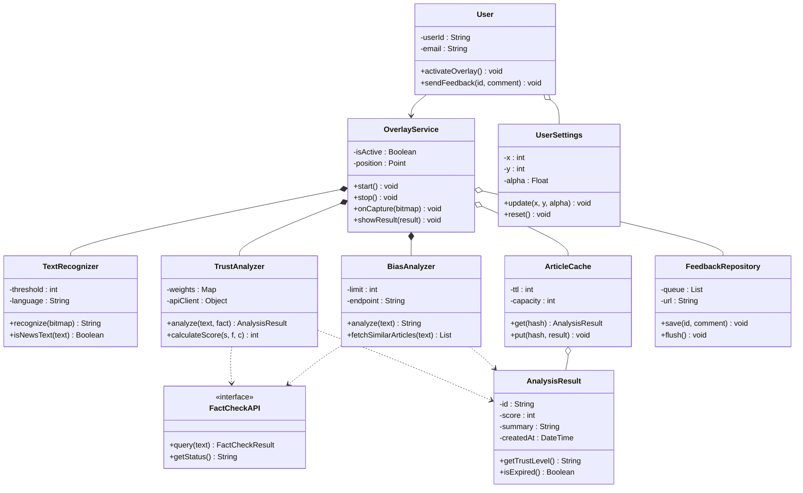

# M2 AI 활용 로그 — 클래스 다이어그램

> **대상 산출물**: `docs/design/class_diagram.md`
> **작성자**: 설계자
> **대상 기간**: 9주차 (M2 설계 착수)
> **사용 도구**: Claude (Anthropic)

---

## 건별 로그 #1 — 클래스 다이어그램 초안 생성

### 프롬프트

```
(파일 첨부: PHASE3-5_UML_작성가이드.pdf)
(파일 첨부: docs/design/usecase_diagram.md)
(파일 첨부: _DKU_C조_PHASE3-3_요구사항정의서.pdf)

첨부한 UML 작성 가이드 §3 형식에 맞춰서
유스케이스 다이어그램을 바탕으로 클래스 다이어그램을 만들어줘.
Mermaid classDiagram 형식으로 작성하고
각 클래스에 속성과 메서드를 최소 2개 이상,
접근 제어자(+/-/#)도 포함해줘.
클래스 간 관계는 연관·합성·집합·의존을 구분해서 표현해줘.
```

---

### AI 응답 요약

Claude가 가이드 §3 형식을 잘 준수하여 접근 제어자, 속성·메서드 2개 이상, 합성·집합·의존 관계를 구분한 classDiagram을 생성하였다. 전체 구조는 사용 가능한 수준이었으나 일부 속성명이 팀이 의도한 것과 달랐고, 관계 설명이 없어서 왜 그 관계를 선택했는지 추적이 안 됐다. `Article` 클래스도 누락되어 있었다.

---

### AI 생성 원본



---

### 비판적 검토

전체 구조와 관계 표기는 가이드를 잘 따랐다. 수정이 필요했던 부분은 형식 오류가 아니라 팀의 표현 방식과 다르거나 정보가 부족했던 부분이다.

| # | 검토 내용 | 판단 |
|---|----------|------|
| 1 | `flowchart`, 접근 제어자, 속성·메서드 최소 2개, 관계 구분 등 가이드 형식 준수 | 적절 |
| 2 | `FactCheckAPI` interface 스테레오타입 포함 | 적절 |
| 3 | 합성·집합·의존 관계 올바르게 구분 | 적절 |
| 4 | 일부 속성명이 너무 축약됨 (`alpha` → `opacity`, `id` → `analysisId`, `score` → `trustScore`) | 수정 필요 |
| 5 | `TrustAnalyzer`의 `weights : Map`, `apiClient : Object` — 타입이 너무 추상적 | 수정 필요 |
| 6 | `Article` 클래스 누락 — `AnalysisResult`가 유사 기사를 포함하는 구조가 표현 안 됨 | 수정 필요 |
| 7 | `User`에 `adjustOverlay()` 메서드 없음 — FR-03(오버레이 조절)이 User 쪽에서도 호출됨 | 수정 필요 |
| 8 | 클래스 도출 근거표(유스케이스 명사 → 클래스 매핑)가 없어 추적이 안 됨 | 수정 필요 |

---

### 수정 내용

**수정 1** — 속성명을 요구사항 정의서·기획서 표현에 맞게 통일

줄임말 없이 의도가 명확하게 읽히는 이름으로 교체하였다.

| AI 원본 | 수정 후 | 이유 |
|---------|---------|------|
| `-alpha : Float` | `-opacity : Float` | 요구사항 정의서 FR-03 표현과 일치 |
| `-id : String` | `-analysisId : String` | `userId`와 구분, 혼동 방지 |
| `-score : int` | `-trustScore : int` | `biasScore`와 구분 목적 |
| `-createdAt : DateTime` | `-timestamp : DateTime` | 팀 내 변수명 컨벤션 통일 |

**수정 2** — `TrustAnalyzer` 속성 타입 구체화

`weights : Map`은 어떤 가중치인지 알 수 없어서 가중치 항목별로 분리하였다. `apiClient : Object`는 의존 관계로 표현하면 충분해서 속성에서 제거하였다.

| AI 원본 | 수정 후 |
|---------|---------|
| `-weights : Map` | `-wSource : Float` / `-wFactCheck : Float` |
| `-apiClient : Object` | 제거 (FactCheckAPI와의 의존 관계로 표현) |

**수정 3** — `Article` 클래스 추가

`BiasAnalyzer.fetchSimilarArticles()`의 반환 타입이 `List`인데 List 안의 요소가 무엇인지 표현이 없었다. FR-04에서 유사 기사 최대 5건을 제공하므로 `Article` 클래스를 추가하고 `AnalysisResult o-- Article` 집합 관계로 연결하였다.

**수정 4** — `User`에 `adjustOverlay()` 메서드 추가

FR-03이 "사용자는 오버레이 창의 위치와 투명도를 조절할 수 있어야 한다"이므로 User 클래스에서 해당 동작이 시작되어야 한다.

**수정 5** — 클래스 도출 근거표 직접 작성

AI가 코드만 생성하고 왜 이 클래스들을 도출했는지는 설명하지 않았다. 팀이 유스케이스 명사 분석 방식(강의 Chap-8 §3 객체 식별)에 따라 직접 매핑 표를 작성하여 추가하였다.

---

### 최종 반영 결과

`docs/design/class_diagram.md`의 `## 클래스 다이어그램` 섹션에 반영 완료.  
관계 구조와 전체 클래스 목록은 AI 원본을 기반으로 하였고, **속성명 4개 교체**, **속성 타입 구체화 2건**, **`Article` 클래스 추가**, **`User` 메서드 1개 추가**, **클래스 도출 근거표 직접 작성**을 팀이 수정·보완하였다.

---

## 건별 로그 #2 — 관계 기수성 및 근거 보완

### 프롬프트

```
(파일 첨부: PHASE3-5_UML_작성가이드.pdf)

아래 클래스 다이어그램에서 주요 관계의 기수성을 추가하고
왜 합성인지 집합인지 근거도 함께 설명해줘.
FR-04에 따르면 유사 기사는 최대 5건이야.

(클래스 다이어그램 코드 붙여넣기)
```

---

### AI 응답 요약

Claude가 각 관계의 기수성과 선택 근거를 표 형식으로 정리하여 제시하였다. 내용은 대체로 맞았으나 `AnalysisResult → Article`의 기수성을 `0..*`으로 작성하여 FR-04의 최대 5건 조건이 반영되지 않았고, 집합과 합성의 근거 설명이 "독립 존재 여부"라는 말 한마디로 짧게 끝났다.

---

### AI 생성 원본 (기수성 표 부분)

| 관계 | 기수성 | 근거 |
|------|--------|------|
| `OverlayService` → `TextRecognizer` | 1 : 1 (합성) | 독립 존재 불가 |
| `AnalysisResult` → `Article` | 1 : 0..* (집합) | 독립 존재 가능 |
| `User` → `UserSettings` | 1 : 1 (집합) | 독립 존재 가능 |

---

### 비판적 검토

| # | 검토 내용 | 판단 |
|---|----------|------|
| 1 | `0..*` — FR-04 최대 5건 조건 미반영 | 수정 필요 |
| 2 | 근거 설명이 "독립 존재 불가/가능" 한 마디로만 끝남 — 왜 그런지 이유가 없음 | 수정 필요 |

---

### 수정 내용

**수정 1** — `0..*` → `0..5` (FR-04 기준 반영)

**수정 2** — 근거 설명에 구체적 이유 추가

| AI 원본 근거 | 수정 후 근거 |
|-------------|-------------|
| 독립 존재 불가 | 서비스 종료 시 인식 모듈도 소멸; 다른 서비스에서 재사용 없음 |
| 독립 존재 가능 | 캐시는 서비스 없이도 TTL 동안 데이터 유지; 다른 분석에서 재사용 가능 |
| 독립 존재 가능 | 사용자 삭제 후에도 설정 이력 보존이 필요할 수 있음 |

---

### 최종 반영 결과

`docs/design/class_diagram.md`의 `## 관계 기수성 및 선택 근거` 표에 반영 완료.  
**기수성 `0..*` → `0..5` 수정 1건**, **근거 설명 구체화 3건**을 팀이 수정하였다.


---

*작성일: 2026-05-11 | 작성자: 분석가*
