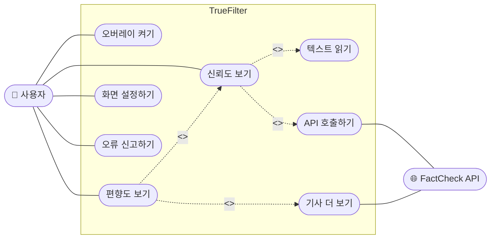

# M2 AI 활용 로그 — 유스케이스 다이어그램

> **대상 산출물**: `docs/design/usecase_diagram.md`
> **작성자**: 분석가
> **대상 기간**: 9주차 (M2 설계 착수)
> **사용 도구**: Claude (Anthropic)

---

## 건별 로그 #1 — 유스케이스 다이어그램 초안 생성

### 프롬프트

```
(파일 첨부: PHASE3-5_UML_작성가이드.pdf)
(파일 첨부: _DKU_C조_PHASE3-3_요구사항정의서.pdf)

첨부한 UML 작성 가이드 §2 형식에 맞춰서
요구사항 정의서의 FR 목록을 유스케이스 다이어그램으로 만들어줘.
Mermaid flowchart 형식으로 작성하고
액터, 시스템 경계, include/extend 관계 포함해줘.
```

---

### AI 응답 요약

Claude가 가이드 §2 형식에 맞춰 `flowchart LR`, `subgraph` 시스템 경계, `<<include>>`/`<<extend>>` 표기를 포함한 코드를 생성하였다. FR 5개가 유스케이스로 변환되었고 FactCheck API 액터도 포함되었다.

---

### AI 생성 원본



---

### 팀이 태클 건 내용

AI가 생성한 초안을 팀원들이 함께 검토하면서 나온 의견이다.

> **분석가**: "신뢰도 보기"가 좀 어색하지 않아? 요구사항 정의서에서는 "신뢰도 확인"이라고 썼는데 통일하는 게 낫지 않을까

> **PM**: 맞아, 우리가 기획서에서 쓴 표현이랑 달라서 나중에 헷갈릴 것 같음. 그리고 "오류 신고하기"도 우리 기능이랑 좀 다른 느낌인데, 우리는 틀린 분석 결과에 피드백 보내는 거잖아

> **설계자**: "TrueFilter"만 적힌 것도 좀 짧은 것 같긴 한데... 공식 문서라면 "TrueFilter 시스템"이라고 써야 할 것 같아

> **분석가**: "API 호출하기"도 너무 기술적인 표현 같음. 사용자 입장에서 보이는 기능 이름이 아니라 구현 방식처럼 들려

---

### AI 활용 교차검증

팀 의견을 반영하여 수정 방향을 잡은 뒤, AI에게 이름 변경이 가이드 기준에 맞는지 검증을 요청하였다.

#### 교차검증 프롬프트

```
(파일 첨부: PHASE3-5_UML_작성가이드.pdf)

유스케이스 이름을 아래처럼 바꾸려고 하는데
가이드의 "동사 + 목적어" 형식에 맞는지 확인해줘.

- 오버레이 켜기 → 오버레이 활성화하기
- 신뢰도 보기 → 신뢰도 확인하기
- 편향도 보기 → 편향도 분석 확인하기
- 화면 설정하기 → 오버레이 설정하기
- 오류 신고하기 → 피드백 전송하기
- 텍스트 읽기 → 텍스트 인식하기
- API 호출하기 → 팩트체크 API 조회하기
- 기사 더 보기 → 유사 기사 조회하기
```

#### AI 교차검증 응답 요약

변경된 이름들이 모두 "동사 + 목적어" 형식을 충족하며, 원래 이름보다 기능의 의미가 더 명확하게 전달된다고 확인하였다. 특히 `API 호출하기` → `팩트체크 API 조회하기`는 구현 관점 표현에서 사용자·기능 관점 표현으로 개선된 점을 긍정적으로 평가하였다. 수정 방향 모두 가이드 기준에 적합하다고 판단하였다.

---

### 최종 반영 결과

`docs/design/usecase_diagram.md`에 반영 완료.  
유스케이스 이름 8개, 시스템 경계명 1개 수정. 구조와 관계는 AI 원본 유지.

---

## 건별 로그 #2 — 유스케이스 설명서 초안 생성

### 프롬프트

```
(파일 첨부: PHASE3-5_UML_작성가이드.pdf)
(파일 첨부: _DKU_C조_PHASE3-3_요구사항정의서.pdf)

UC-02 "신뢰도 확인하기"의 유스케이스 설명서를 작성해줘.
가이드 §2-2 형식(식별부, 정상 시나리오, 예외 처리)으로 써줘.
요구사항 정의서의 NFR-01(2초 이내)과 FR-02(5단계 계산 방식)도 반영해줘.
```

---

### AI 응답 요약

식별부, 정상 시나리오 4단계, 예외 처리 3개 항목을 포함한 설명서를 생성하였다. 전반적인 구조는 가이드 형식에 맞았으나 예외 처리 서술이 결과만 적혀 있고 어떻게 처리되는지 동작이 빠져 있었다.

---

### AI 생성 원본 (예외 처리 부분)

| 식별자 | 예외 상황 | 처리 |
|--------|-----------|------|
| E-1 | API 응답 없음 | 오류 메시지 표시 |
| E-2 | 텍스트 인식 실패 | 오버레이 미표시 |
| E-3 | 네트워크 오류 | 재시도 안내 |

---

### 비판적 검증

"오류 메시지 표시"는 너무 두루뭉술하다, 스트 인식 실패가 정확히 어떤 상황인지도 모르겠다, API 오류 났을 때 그냥 안 보여주는 건 아니고 부분적으로 계산해서 보여주는 방식으로 하기로 했으므로 수정이 필요.

---

### AI 활용 교차검증

팀 의견을 바탕으로 예외 처리 내용을 구체화한 뒤, 정상 시나리오 흐름과 충돌이 없는지 AI에게 검증을 요청하였다.

#### 교차검증 프롬프트

```
(파일 첨부: _DKU_C조_PHASE3-3_요구사항정의서.pdf)

아래 예외 처리 내용이 정상 시나리오 흐름과 충돌하지 않는지 확인해줘.
그리고 빠진 케이스가 있으면 말해줘.

수정한 예외 처리:
- API 응답 2초 초과 → 타임아웃 처리 후 "분석 중" 표시, 결과 도착 시 업데이트
- 인식 텍스트 30자 미만 → 오버레이 미표시
- API HTTP 5xx 오류 → 출처·인용 점수만으로 부분 계산 후 "팩트체크 미포함" 표시
```

#### AI 교차검증 응답 요약

정상 시나리오와 충돌 없음을 확인하였다. 추가로 캐시에 저장된 만료 결과를 다시 표시하는 케이스(TTL 초과 후 재분석 시점)가 예외 처리에 빠져 있다고 지적하였다. 팀 논의 결과 해당 케이스는 M3 구현 단계에서 다루기로 하고 이번 설명서에는 포함하지 않기로 결정하였다.

---

### 최종 반영 결과

`docs/design/usecase_diagram.md`의 유스케이스 설명서 섹션에 반영 완료.  
예외 처리 서술 3개 구체화, 정상 시나리오 Step 5에 `← NFR-01: 2초 이내` 명시.

---


*작성일: 2026-05-11 | 작성자: 분석가*
