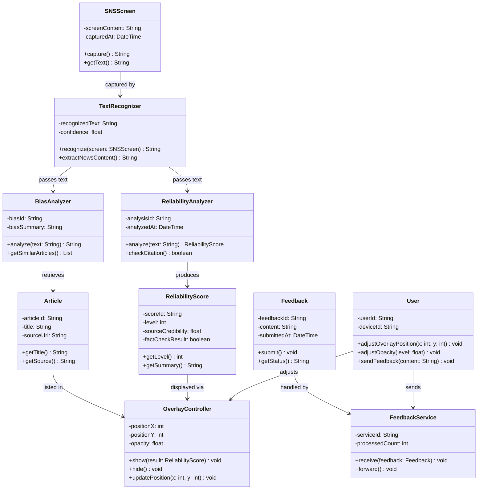

# M2 AI 활용 로그 — 클래스 다이어그램

**대상 산출물**: `docs/design/class_diagram.md`  
**작성자**: 설계자  
**대상 기간**: 10주차 (M2 설계 착수)  
**사용 도구**: Claude (Anthropic)

---

## ■ 건별 로그 #1 — 클래스 다이어그램 초안 생성

### 1.1 프롬프트

> (파일 첨부: PHASE3-5_UML_작성가이드.pdf)  
> (파일 첨부: \_DKU\_C조\_PHASE3-3\_요구사항정의서.pdf)
>
> 첨부한 UML 작성 가이드 §3 형식에 맞춰서 요구사항 정의서의 FR 목록을 클래스 다이어그램으로 만들어줘. Mermaid classDiagram 형식으로 작성해줘.

### 1.2 AI 응답 요약

요구사항 정의서(트루필터 프로젝트)의 FR 목록을 UML 작성 가이드 §3 형식에 맞춰 Mermaid 클래스 다이어그램으로 작성.

### 1.3 AI 생성 원본

> **[설계자 주]** 아래는 AI 초안 원본이며, 이후 팀 검토 및 교차검증을 거쳐 클래스명이 최종 다이어그램 기준으로 변경되었습니다.  
> 변경 내역: `ReliabilityAnalyzer` → `TrustAnalyzer` / `ReliabilityScore` → `AnalysisResult` / `OverlayController` → `OverlayService` / `FeedbackService`+`Feedback` → `FeedbackRepository` / `SNSScreen` → `OverlayService.onScreenCapture()` 흡수

FR 목록에서 도출한 클래스:

- **FR-01** (화면 텍스트 인식) → `TextRecognizer`, `SNSScreen` *(→ 최종: `SNSScreen` 제거, `OverlayService`로 흡수)*
- **FR-02** (신뢰도 5단계 계산) → `ReliabilityAnalyzer`, `ReliabilityScore` *(→ 최종: `TrustAnalyzer`, `AnalysisResult`)*
- **FR-03** (오버레이 위치·투명도 조절) → `OverlayController`, `User` *(→ 최종: `OverlayService`)*
- **FR-04** (유사 기사 리스트 제공) → `BiasAnalyzer`, `Article`
- **FR-05** (피드백 전송) → `FeedbackService`, `Feedback` *(→ 최종: `FeedbackRepository`로 통합)*

### 1.4 팀이 태클 건 내용

AI가 생성한 초안을 팀원들이 함께 검토하면서 나온 주요 의견 요약:

- **PM**: `BiasAnalyzer`랑 `TrustAnalyzer` 굳이 나눠야 해요? 그냥 합치면 안 돼요?  
  **분석가**: FR-02랑 FR-04가 엄연히 다른 기능인데요. 합치면 단일 책임 원칙 위반이에요.

- **PM**: 그리고 `SNSScreen` 클래스가 왜 필요해요? 그냥 `TextRecognizer`에 넣으면 되잖아요.  
  **분석가**: 화면 캡처 책임이랑 텍스트 인식 책임은 달라요. FR-01 추적성 때문에라도 분리해야 해요.  
  *(→ 최종 결정: `SNSScreen`의 캡처 책임은 `OverlayService.onScreenCapture(bitmap)`으로 이관하여 합성 구조 내 처리)*

### 1.5 AI 활용 교차검증

팀 의견을 반영하여 수정 방향을 잡은 뒤, AI에게 이름 변경이 가이드 기준에 맞는지 검증을 요청하였다.

**교차검증 프롬프트**

> 위 팀 회의 내용을 바탕으로 클래스 구조를 다시 수정해줘. `BiasAnalyzer`/`TrustAnalyzer` 분리 유지, `SNSScreen` 처리 방식 재검토를 반영해서 Mermaid classDiagram으로 작성해줘.

**AI 교차검증 응답 요약**

- **설계 원칙 및 책임 분리**: 단일 책임 원칙(SRP)과 팀 피드백을 반영하여 `TrustAnalyzer`/`BiasAnalyzer` 구조를 분리 유지하고, `SNSScreen`의 캡처 역할을 `OverlayService`로 이관하여 클래스 구조를 정제함.
- **UML 가이드 및 표준 문법 준수**: 가이드 §3에 따라 Mermaid `classDiagram` 형식으로 전환하고, Generic 표기법(`List~Article~`) 오류 수정 및 변수 타입 순서를 정렬함.
- **기능 요구사항 추적성 강화**: 각 클래스 간의 관계선(의존·연관)을 직관적으로 재정의하고 다이어그램 내부에 요구사항 식별자(FR-01~FR-05)를 주석으로 명시하여 설계 추적성을 보완함.

### 1.6 최종 반영 결과

`docs/design/usecase_diagram.md`에 반영 완료.

---

## ■ 건별 로그 #2 — 클래스 다이어그램 설명서 초안 생성

### 2.1 프롬프트

> (파일 첨부: PHASE3-5_UML_작성가이드.pdf)  
> (파일 첨부: \_DKU\_C조\_PHASE3-3\_요구사항정의서.pdf)
>
> 건별 로그 #1에서 도출된 `TextRecognizer`, `OverlayService`, `TrustAnalyzer`, `AnalysisResult`, `BiasAnalyzer`, `Article` 등의 클래스 구조를 바탕으로 클래스 다이어그램 설명서를 작성해줘. 가이드 §2-2 형식(식별부, 정상 시나리오, 예외 처리)으로 써줘. 팀 회의에서 논의된 단일 책임 원칙(화면 캡처와 텍스트 인식 분리, 신뢰도 분석과 편향성 분석 분리)을 고려하여 시스템 흐름을 반영해줘.

### 2.2 AI 응답 요약

건별 로그 #1의 클래스 설계 및 팀 피드백을 반영하여 UML 작성 가이드 형식에 맞춘 클래스 다이어그램 설명서 구조를 정상 시나리오 및 예외 처리를 포함하여 작성.

### 2.3 AI 생성 원본 (예외 처리 부분)

| 식별자 | 예외 상황 | 처리 |
|--------|----------|------|
| E-1 | 화면 캡처 실패 (`OverlayService.onScreenCapture()`) | 텍스트 인식 단계를 진행하지 않고 사용자에게 캡처 실패 알림을 보냄 |
| E-2 | 텍스트 인식 불가능 (`TextRecognizer`) | 분석 클래스로 데이터 전달을 중단하고 오버레이를 표시하지 않음 |
| E-3 | 분석 레이어 수신 오류 | `TrustAnalyzer` 또는 `BiasAnalyzer` 호출 실패 시 기본 안내 메시지 출력 |

### 2.4 비판적 검증 (팀 피드백)

- 화면 캡처 실패나 텍스트 인식 불가능 상황에서 단순히 기능을 중단하기보다 시스템이 내부적으로 재시도하거나 사용자에게 구체적인 가이드를 제공하는 서술이 필요함.
- 단일 책임 원칙으로 `OverlayService`와 `TextRecognizer`를 명확히 분리했으므로, 각 클래스 간 데이터 전달 실패 시의 예외 경계가 더 상세히 정의되어야 함.
- `BiasAnalyzer`와 `TrustAnalyzer`가 독립적으로 동작하므로, 한쪽 분석에 오류가 발생하더라도 다른 쪽 결과는 정상적으로 표현될 수 있도록 예외 처리가 결합 구조를 가져서는 안 됨.

### 2.5 AI 활용 교차검증

**교차검증 프롬프트**

> 위에서 작성된 설명서 초안의 예외 처리 로직이 건별 로그 #1에서 합의된 클래스 간 독립성(SRP) 및 정상 시나리오 흐름과 충돌하지 않는지 확인해줘. 특히 `OverlayService`와 `TextRecognizer`의 분리 구조에서 발생할 수 있는 데이터 누락 케이스가 누락되지 않았는지 검증해줘.

**AI 교차검증 응답 요약**

구조적 독립성 검증 결과, 분석 클래스 분리에 따른 개별 예외 처리는 정상 시나리오의 흐름을 방해하지 않고 독립적으로 수행 가능함을 확인받음. 다만, `OverlayService`에서 `TextRecognizer`로 인식된 객체가 넘어갈 때 데이터가 유실되거나 `null` 값이 전달되는 경계 조건에 대한 예외 서술이 보완되어야 한다는 기술적 제언을 반영함.

### 2.6 최종 반영 결과

`docs/design/usecase_diagram.md`의 클래스 다이어그램 설명서 섹션에 최종 반영을 완료함. 클래스 간 책임을 명확히 구분한 정상 시나리오 단계를 확정하고, 분리된 컴포넌트별 예외 대응 로직을 세부 서술로 구체화하여 명시함.

---

*작성일: 2026-05-16 | 작성자: 설계자*
