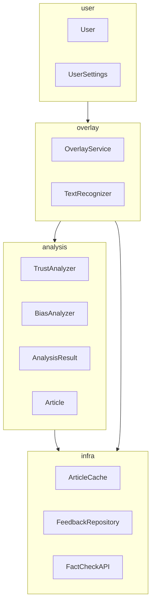
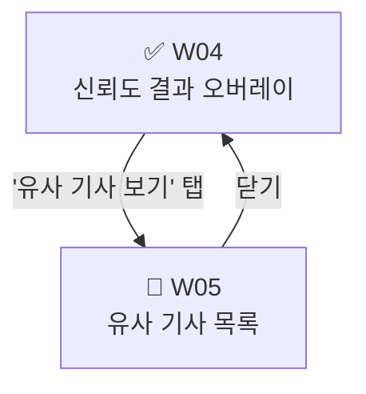

# M2 AI 활용 로그 — 객체지향 설계

> **대상 산출물**: `docs/oo_design.md`
> **작성자**: 설계자
> **대상 기간**: 12주차 (M2 설계 마무리)
> **사용 도구**: Claude (Anthropic)

---

## 건별 로그 #1 — 팩토링·파티셔닝·계층화 기법 적용 및 패키지 다이어그램 초안 생성

### 프롬프트

```
(파일 첨부: class_diagram.md)
(파일 첨부: usecase_diagram.md)

첨부한 클래스 다이어그램과 유스케이스 다이어그램을 바탕으로
아래 세 가지 설계 기법을 순서대로 적용해줘.

1. 팩토링: 함수 추출, 클래스 추출, 이름 변경, 상속 구조 확인 기준으로
   현재 클래스 다이어그램에 적용된 내용을 정리해줘.

2. 파티셔닝: 클래스들을 기능과 책임 기준으로 패키지로 묶고
   패키지 다이어그램을 Mermaid graph TD 형식으로 작성해줘.
   패키지 간 의존성 방향도 분석해줘.

3. 계층화: HCI / PD / DM 3계층 아키텍처로 패키지를 배치하고
   Mermaid graph TD 형식으로 작성해줘.
```

---

### AI 응답 요약

Claude가 클래스 다이어그램의 합성·집합·의존 관계를 분석하여 `overlay`, `analysis`, `user`, `infra` 4개 패키지를 도출하였다. 팩토링 적용 내역은 기존 클래스 다이어그램에서 이미 반영된 사항(함수 추출, 클래스 추출)을 정리하는 방식으로 서술되었다. 3계층 배치는 `overlay`+`user` → HCI, `analysis` → PD, `infra` → DM으로 구성되었다.

---

### AI 생성 원본



---


### AI 활용 교차검증

팀 의견을 반영하여 수정 방향을 잡은 뒤, 패키지 묶음 근거가 클래스 다이어그램의 관계 표기와 일치하는지 AI에게 검증을 요청하였다.

#### 교차검증 프롬프트

```
(파일 첨부: class_diagram.md)

아래 패키지 묶음이 클래스 다이어그램의 관계 표기(합성·집합·의존)와
일치하는지 확인해줘. 잘못 묶인 클래스가 있으면 말해줘.

- overlay: OverlayService, TextRecognizer
- analysis: TrustAnalyzer, BiasAnalyzer, AnalysisResult, Article
- user: User, UserSettings
- infra: ArticleCache, FeedbackRepository, FactCheckAPI
```

#### AI 교차검증 응답 요약

4개 패키지 묶음이 클래스 다이어그램의 관계 표기와 모두 일치한다고 확인하였다. `OverlayService *-- TextRecognizer` 합성 관계로 `overlay` 묶음이 타당하고, `User o-- UserSettings` 집합 관계로 `user` 묶음이 타당하다고 설명하였다. `FactCheckAPI`를 `infra`에 넣는 것도 외부 연동 책임 기준으로 적절하다고 판단하였다. 잘못 묶인 클래스는 없었다.

---

### 최종 반영 결과

`docs/oo_design.md` 섹션 1·2·3에 반영 완료.
패키지 이름에 이모지 추가, `FactCheckAPI <<interface>>` 표기 추가, 의존성 방향 원칙 및 각 화살표 근거 표 추가. 구조와 관계는 AI 원본 유지.

---

## 건별 로그 #2 — 자료 구조 설계 (DB 테이블) 초안 생성

### 프롬프트

```
(파일 첨부: class_diagram.md)

클래스 다이어그램을 기반으로 DB 테이블 설계를 해줘.
아래 원칙을 지켜줘.

- PD 계층 클래스 전체를 테이블로 매핑해줘.
- 앱 재실행 시 유지가 필요한 HCI 계층 클래스(UserSettings)도 포함해줘.
- 처리 로직 클래스(OverlayService, TextRecognizer, TrustAnalyzer, BiasAnalyzer)는 테이블 생성 제외.
- 멤버 변수만 컬럼으로 변환하고, 메서드는 제외해줘.
- 휘발성(런타임 전용) 변수는 제외해줘.
- AnalysisResult 1 : Article 0..5 관계를 외래키로 반영해줘.
- 각 테이블마다 어떤 필드를 제외했는지 근거도 적어줘.
```

---

### AI 응답 요약

`analysis_result`, `article`, `user_settings`, `feedback` 4개 테이블을 생성하였다. 컬럼 타입과 제약 조건, 외래키 관계를 포함하였으며 각 테이블 하단에 제외 필드 근거도 서술하였다. 전반적인 구조는 요구사항과 부합하였으나 `feedback` 테이블에서 오프라인 큐 지원 여부가 컬럼에 반영되지 않았고, `analysis_result`의 캐시 만료 처리를 위한 `expires_at` 컬럼이 빠져 있었다.

---

### AI 생성 원본 (`analysis_result` 테이블 일부)

| 컬럼명 | 타입 | 제약 | 설명 |
|--------|------|------|------|
| `analysis_id` | VARCHAR(36) | PK | UUID |
| `trust_score` | INT | NOT NULL | 신뢰도 점수 |
| `bias_summary` | TEXT | NULL | 편향도 요약 |
| `source_text_hash` | VARCHAR(64) | NOT NULL | 텍스트 해시 |
| `created_at` | DATETIME | NOT NULL | 생성 시각 |

---

### 비판적 검증

`ArticleCache`의 `ttlSeconds` 필드가 캐시 만료 시각을 계산하는 데 쓰이는데, 테이블에 `expires_at`이 없으면 만료 판단 로직이 없어진다. `FeedbackRepository`가 오프라인 큐를 지원하는 구조(`flush()` 메서드)인데 테이블에 전송 상태 컬럼이 없으면 큐 기능을 구현할 수 없다. 두 가지 모두 수정이 필요하다.

---

### AI 활용 교차검증

팀 의견을 바탕으로 누락 컬럼을 추가한 뒤, 컬럼 구성이 클래스 다이어그램의 멤버 변수와 일치하는지 AI에게 검증을 요청하였다.

#### 교차검증 프롬프트

```
(파일 첨부: class_diagram.md)

아래 테이블 컬럼 구성이 클래스 다이어그램의 멤버 변수 목록과
일치하는지 확인해줘. 누락된 멤버 변수나 잘못 포함된 항목이 있으면 말해줘.

- analysis_result: analysis_id, trust_score, trust_level, bias_summary,
  source_text_hash, created_at, expires_at
- feedback: feedback_id, analysis_id, comment, is_sent, created_at, sent_at
```

#### AI 교차검증 응답 요약

`trust_level`은 클래스 멤버 변수에 없고 `getTrustLevel()` 메서드로만 존재한다고 지적하였다. 다만 조회 성능과 결과 재현을 위해 파생 값을 컬럼으로 저장하는 방식은 일반적인 관행이므로 의도적 추가라면 근거를 주석으로 명시하는 것이 좋다고 제안하였다. `is_sent`, `sent_at`은 클래스에 명시된 변수는 아니지만 `flush()` 메서드의 구현을 지원하기 위한 설계상 추가이므로 적절하다고 확인하였다. 그 외 누락이나 오류는 없었다.

---

### 최종 반영 결과

`docs/oo_design.md` 섹션 4에 반영 완료.
`analysis_result` 테이블에 `expires_at` 추가, `feedback` 테이블에 `is_sent`·`sent_at` 추가. `trust_level` 컬럼 근거를 제외 필드 설명에 명시. AI 원본 구조 유지.

---

## 건별 로그 #3 — 사용자 인터페이스 설계 초안 생성

### 프롬프트

```
(파일 첨부: usecase_diagram.md)
(파일 첨부: class_diagram.md)

유스케이스 다이어그램을 기반으로 UI 설계를 해줘.
아래 두 가지를 작성해줘.

1. 사용 시나리오: 사용자가 TrueFilter를 처음 실행해서
   신뢰도 확인 → 편향도 확인 → 설정 변경 → 피드백 전송까지
   이어지는 전체 흐름을 서술해줘. 각 단계마다 대응되는 유스케이스 ID도 표시해줘.

2. 윈도우 내비게이션 다이어그램: 각 화면을 W01~W0N으로 정의하고
   화면 간 전환 흐름을 Mermaid flowchart TD 형식으로 작성해줘.
   예외 흐름(권한 거부, API 타임아웃 등)도 포함해줘.
```

---

### AI 응답 요약

사용 시나리오 8단계와 W01~W08 윈도우 8개를 포함한 내비게이션 다이어그램을 생성하였다. 유스케이스 ID 대응과 예외 흐름(권한 거부, API 타임아웃)이 포함되었다. 전체적인 흐름은 유스케이스 다이어그램과 일치하였으나 W04에서 SNS 앱으로 돌아가는 흐름이 없었고, 외부 브라우저로 기사 원문을 여는 W05 분기가 빠져 있었다.

---

### AI 생성 원본 (W04~W05 부분)



---

### 비판적 검증

W04에서 사용자가 오버레이를 그대로 두고 SNS 피드를 계속 스크롤하면 다음 텍스트가 감지되어 W03(분석 중)으로 다시 돌아가야 하는데 이 흐름이 빠져 있다. W05에서 기사를 탭하면 앱 내에서 처리하는 게 아니라 외부 브라우저로 연결되는 구조인데, 이 분기 역시 다이어그램에 없다. 두 흐름 모두 실제 사용 패턴에서 자주 발생하는 경우이므로 추가가 필요하다.

---

### AI 활용 교차검증

누락 흐름을 추가한 뒤, 전체 내비게이션 다이어그램이 유스케이스 다이어그램의 UC 목록을 빠짐없이 커버하는지 AI에게 검증을 요청하였다.

#### 교차검증 프롬프트

```
(파일 첨부: usecase_diagram.md)

아래 윈도우 목록이 유스케이스 다이어그램의 UC-01~UC-05를
모두 커버하는지 확인해줘. 빠진 유스케이스가 있으면 말해줘.

W01: 앱 시작 / 권한 요청
W02: 오버레이 비활성 상태
W03: 분석 중 오버레이
W04: 신뢰도 결과 오버레이
W05: 유사 기사 목록
W06: 오버레이 설정
W07: 피드백 입력 폼
W08: 피드백 전송 완료
```

#### AI 교차검증 응답 요약

UC-01(오버레이 활성화) → W01~W02, UC-02(신뢰도 확인) → W03~W04, UC-03(편향도 분석 확인) → W04~W05, UC-04(오버레이 설정) → W06, UC-05(피드백 전송) → W07~W08 으로 UC 5개가 모두 커버된다고 확인하였다. 누락된 유스케이스 없음.

---

### 최종 반영 결과

`docs/oo_design.md` 섹션 5에 반영 완료.
W04 → W03 재진입 흐름, W05 → 외부 브라우저 분기 추가. 화면별 설명 표에 대응 유스케이스 ID 명시. AI 원본 구조 유지.

---

*작성일: 2026-06-01 | 작성자: 설계자*
