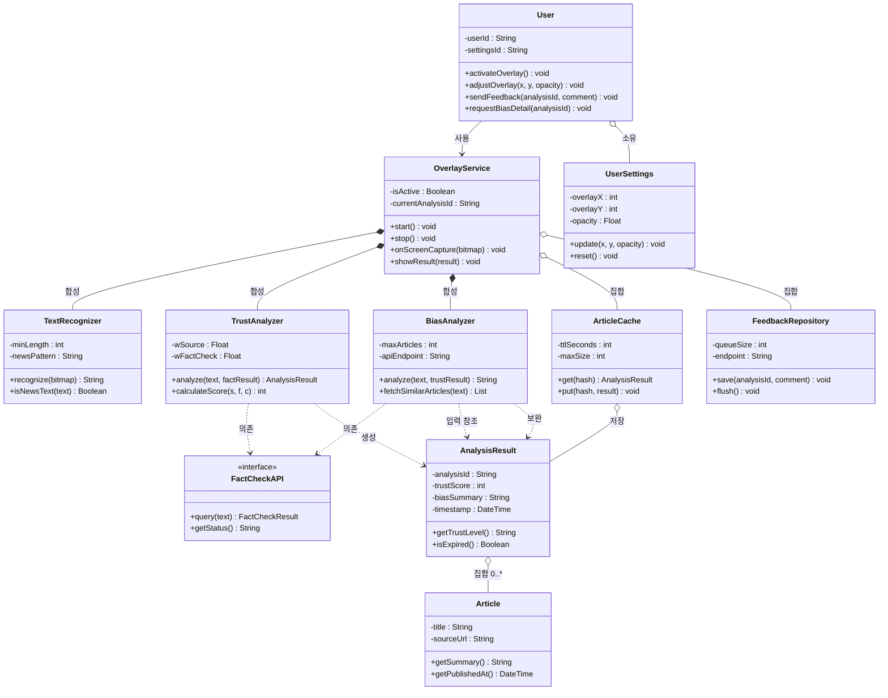

# TrueFilter — 클래스 다이어그램

> **작성 기준**: PHASE3-5 UML 작성 가이드 §3  
> **주 작성자**: 설계자 | **부 작성자**: pm  
> **버전**: v1.1 | **작성일**: 2026-05-18 | **마일스톤**: M2

---

## 클래스 도출 근거 (유스케이스 명사 분석 — 가이드 §3-2 Step 1)

| 유스케이스 등장 명사 | 도출 클래스 | 관련 FR |
|---------------------|------------|---------|
| 텍스트, 화면 캡처 | `TextRecognizer` | FR-02 |
| 신뢰도 점수, 분석 결과 | `TrustAnalyzer`, `AnalysisResult` | FR-02 |
| 편향도 요약, 유사 기사 | `BiasAnalyzer`, `Article` | FR-04 |
| 오버레이 서비스 | `OverlayService` | FR-01, FR-02 |
| 사용자 설정 (위치·투명도) | `UserSettings` | FR-03 |
| 캐시 | `ArticleCache` | FR-02 (NFR-01 대응) |
| 피드백 | `FeedbackRepository` | FR-05 |
| 팩트체크 API (외부) | `FactCheckAPI` (interface) | FR-02, FR-04 |

---

## 클래스 다이어그램

---

## 관계 기수성 및 선택 근거

| 관계 | 표기 | 기수성 | 근거 |
|------|------|--------|------|
| `OverlayService` → `TextRecognizer` | 합성(`*--`) | 1 : 1 | 서비스 종료 시 인식 모듈도 함께 소멸; 독립 존재 불가 |
| `OverlayService` → `ArticleCache` | 집합(`o--`) | 1 : 1 | 캐시는 서비스 없이도 데이터 유지 가능 (TTL 기반 독립 존재) |
| `AnalysisResult` → `Article` | 집합(`o--`) | 1 : 0..5 | FR-04: 유사 기사 최대 5건; 기사 객체는 캐시에서 재사용 가능 |
| `TrustAnalyzer` → `FactCheckAPI` | 의존(`..>`) | — | 분석 실행 시에만 일시적으로 호출; 지속적 참조 없음 |
| `User` → `UserSettings` | 집합(`o--`) | 1 : 1 | 사용자 삭제 후에도 설정 이력 별도 보존 가능 |
| `BiasAnalyzer` → `AnalysisResult` | 의존(`..>`) | — | UC03 `<<include>>` UC02 반영: `analyze(text, trustResult)`로 TrustAnalyzer 결과를 입력받아 보완. OverlayService가 TrustAnalyzer → BiasAnalyzer 순서로 호출 |
| `BiasAnalyzer.fetchSimilarArticles()` | — | 조건부 | UC03 `<<extend>>` UCS3 반영: 사용자가 상세 버튼 탭 시에만 호출; `analyze()` 실행과 별개로 동작 |

*최종 수정: 2026-05-18 | 담당: 설계자*
