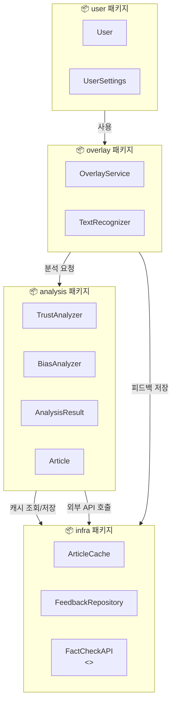
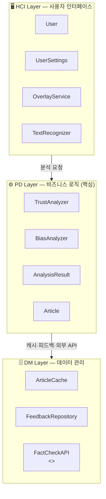
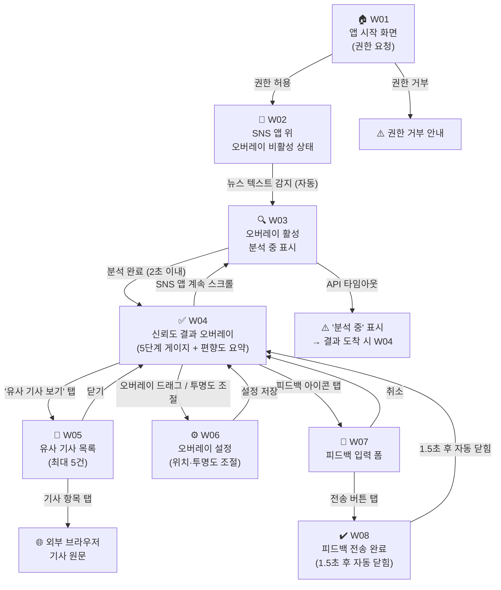

# TrueFilter — 객체지향 설계 (OO Design)

> **주 작성자**: 설계자 | **버전**: v1.0 | **작성일**: 2026-06-01 | **마일스톤**: M2

---

## 목차

1. [설계 기법 적용 개요](#1-설계-기법-적용-개요)
2. [패키지 다이어그램](#2-패키지-다이어그램)
3. [3계층 아키텍처](#3-3계층-아키텍처)
4. [자료 구조 설계 (DB 테이블)](#4-자료-구조-설계-db-테이블)
5. [사용자 인터페이스 설계](#5-사용자-인터페이스-설계)

---

## 1. 설계 기법 적용 개요

클래스 다이어그램(v1.1)의 11개 클래스를 아래 세 가지 기법을 순서대로 적용하여 구현 가능한 설계로 발전시킨다.

| 기법 | 적용 목적 | TrueFilter 적용 결과 |
|------|-----------|---------------------|
| **팩토링** | 개별 코드 단위 품질 향상 | 함수 추출·클래스 추출·이름 정비·상속 구조 확인 |
| **파티셔닝** | 시스템 복잡성 관리 | 기능·책임 기준으로 4개 패키지로 분리 |
| **계층화** | 관심사 분리, 의존성 관리 | HCI / PD / DM 3계층으로 패키지 배치 |

### 팩토링 적용 내역

| 기법 | 대상 | 내용 |
|------|------|------|
| 함수 추출 | `TrustAnalyzer.analyze()` | 가중합 계산 로직을 `calculateScore(s, f, c)` 메서드로 분리 (이미 반영됨) |
| 클래스 추출 | `AnalysisResult` | `TrustAnalyzer`의 반환 데이터를 독립 클래스로 분리하여 `BiasAnalyzer`와 공유 |
| 이름 변경 | `FactCheckAPI` | 외부 인터페이스임을 명확히 하기 위해 `<<interface>>` 스테레오타입 + `I` 접두 규칙 적용 |
| 상속 구조 확인 | 전체 클래스 | 현재 상속 관계 없음 — `FactCheckAPI`를 인터페이스로 유지, 구현체(`MockFactCheckAPI` 등)는 추후 확장 |

---

## 2. 패키지 다이어그램

### 패키지 도출 근거

클래스 다이어그램의 합성·집합·의존 관계를 기준으로 아래 4개 패키지로 묶었다.

| 패키지 | 포함 클래스 | 묶음 근거 |
|--------|------------|-----------|
| `overlay` | `OverlayService`, `TextRecognizer` | 합성(`*--`) 관계 — `TextRecognizer`는 `OverlayService` 없이 독립 존재 불가 |
| `analysis` | `TrustAnalyzer`, `BiasAnalyzer`, `AnalysisResult`, `Article` | `TrustAnalyzer`→`AnalysisResult` 생성, `BiasAnalyzer`→`AnalysisResult` 보완 — 분석 책임 응집 |
| `user` | `User`, `UserSettings` | `User o-- UserSettings` 집합 관계 — 사용자 도메인 응집 |
| `infra` | `ArticleCache`, `FeedbackRepository`, `FactCheckAPI` | 데이터 영속성·외부 통신 담당 — 기술 인프라 책임 응집 |

### 패키지 다이어그램 (Mermaid)



### 패키지 간 의존성 분석

| 의존 방향 | 관계 타입 | 근거 |
|-----------|-----------|------|
| `user` → `overlay` | 사용(Association) | `User.activateOverlay()` — 사용자가 오버레이 서비스를 직접 호출 |
| `overlay` → `analysis` | 사용(Association) | `OverlayService`가 `TrustAnalyzer`, `BiasAnalyzer`를 합성으로 보유하며 순서대로 호출 |
| `analysis` → `infra` | 의존(Dependency) | `TrustAnalyzer`·`BiasAnalyzer`가 `FactCheckAPI` 일시 호출; `ArticleCache` 조회/저장 |
| `overlay` → `infra` | 의존(Dependency) | `OverlayService`가 `FeedbackRepository`를 집합으로 보유 |

> **의존성 방향 원칙**: `user` → `overlay` → `analysis` → `infra` 단방향 흐름 유지. `infra`에서 상위 패키지로 역방향 의존 없음.

---

## 3. 3계층 아키텍처

### 계층 정의

| 계층 | 역할 | 포함 패키지 / 클래스 |
|------|------|---------------------|
| **HCI Layer** (Human Computer Interface) | 사용자와의 상호작용 담당 — 오버레이 화면 표시, 입력 수신 | `overlay` 패키지 (`OverlayService`, `TextRecognizer`), `user` 패키지 (`User`, `UserSettings`) |
| **PD Layer** (Problem Domain) | 핵심 비즈니스 로직 처리 — 신뢰도·편향도 분석 | `analysis` 패키지 (`TrustAnalyzer`, `BiasAnalyzer`, `AnalysisResult`, `Article`) |
| **DM Layer** (Data Manipulation) | 데이터 영속성 및 외부 시스템 연동 | `infra` 패키지 (`ArticleCache`, `FeedbackRepository`, `FactCheckAPI`) |

### 3계층 아키텍처 다이어그램 (Mermaid)



### 계층 간 의존성 원칙

- **단방향 흐름**: HCI → PD → DM 방향만 허용. 역방향(DM → PD, PD → HCI) 의존 금지.
- **PD 계층 독립성**: `TrustAnalyzer`, `BiasAnalyzer`는 UI 변경이나 DB 변경에 영향받지 않도록 설계. HCI·DM 계층 교체 시에도 PD 계층 코드 수정 불필요.
- **인터페이스 격리**: `FactCheckAPI`를 `<<interface>>`로 정의하여 외부 API 변경 시 DM 계층 내부 구현체만 교체 가능.

---

## 4. 자료 구조 설계 (DB 테이블)

PD 계층(`analysis` 패키지)의 클래스를 기준으로 데이터베이스 테이블을 설계한다.  
`HCI Layer`의 `UserSettings`는 앱 재실행 시 설정 유지가 필요하므로 추가 포함.  
`OverlayService`, `TextRecognizer`, `TrustAnalyzer`, `BiasAnalyzer`는 처리 로직 클래스이므로 테이블 미생성.

### 설계 가이드라인 적용

| 원칙 | 적용 내용 |
|------|-----------|
| 클래스 → 테이블 1:1 매핑 | `AnalysisResult`, `Article`, `UserSettings`, `FeedbackRepository` → 각 1개 테이블 |
| 멤버 변수 → 컬럼 매핑 | 각 클래스의 필드를 컬럼으로 변환 |
| 휘발성 변수 제거 | `OverlayService.isActive`(런타임 상태), `TrustAnalyzer.wSource`(계산용 상수) 등 제외 |
| 상속 관계 처리 | 현재 상속 관계 없음 — 적용 불필요 |
| 1:N 관계 처리 | `AnalysisResult` 1 : `Article` 0..5 → `Article` 테이블에 외래키 추가 |

---

### TABLE: analysis_result

> 근거 클래스: `AnalysisResult` (PD Layer)

| 컬럼명 | 타입 | 제약 | 설명 |
|--------|------|------|------|
| `analysis_id` | VARCHAR(36) | PK | UUID, 분석 결과 고유 식별자 |
| `trust_score` | INT | NOT NULL | 신뢰도 점수 (0~100) |
| `trust_level` | VARCHAR(10) | NOT NULL | 5단계 레벨 ('매우낮음'~'매우높음') |
| `bias_summary` | TEXT | NULL | 편향도 1문장 요약 |
| `source_text_hash` | VARCHAR(64) | NOT NULL, INDEX | 원문 텍스트 SHA-256 해시 (캐시 키) |
| `created_at` | DATETIME | NOT NULL | 분석 생성 시각 |
| `expires_at` | DATETIME | NOT NULL | 캐시 만료 시각 (TTL 기반) |

> **제외 필드**: `timestamp`는 `created_at`으로 대체. `isExpired()`는 메서드이므로 제외.  
> **설계상 추가 컬럼 근거**:  
> - `source_text_hash`: `AnalysisResult` 클래스 멤버 변수에는 없으나, `ArticleCache.get(hash)` / `put(hash, result)` 메서드가 해시 키로 캐시를 조회·저장하는 구조이므로 해시값을 결과와 함께 영속화해야 캐시 재구성 및 중복 분석 방지가 가능하다. `ArticleCache`(DM Layer) 내부에서만 관리할 경우 캐시 초기화 후 재조회가 불가능하므로 `analysis_result` 테이블에 보관한다.  
> - `trust_level`: `AnalysisResult.getTrustLevel()` 메서드에서 `trust_score`를 기반으로 파생되는 값이나, 조회 성능 및 결과 재현 일관성을 위해 컬럼으로 저장한다 .

---

### TABLE: article

> 근거 클래스: `Article` (PD Layer)  
> `AnalysisResult` 1 : `Article` 0..5 관계 반영 → `analysis_id` 외래키 추가

| 컬럼명 | 타입 | 제약 | 설명 |
|--------|------|------|------|
| `article_id` | VARCHAR(36) | PK | UUID |
| `analysis_id` | VARCHAR(36) | FK → analysis_result.analysis_id | 소속 분석 결과 |
| `title` | VARCHAR(255) | NOT NULL | 기사 제목 |
| `source_url` | TEXT | NOT NULL | 기사 원문 URL |
| `published_at` | DATETIME | NULL | 기사 발행 시각 |

> **제외 필드**: `getSummary()`, `getPublishedAt()`은 메서드이므로 제외.

---

### TABLE: user_settings

> 근거 클래스: `UserSettings` (HCI Layer — 앱 재실행 시 설정 유지 필요, ILF 포함)

| 컬럼명 | 타입 | 제약 | 설명 |
|--------|------|------|------|
| `settings_id` | VARCHAR(36) | PK | UUID |
| `user_id` | VARCHAR(36) | NOT NULL, INDEX | 소유 사용자 식별자 |
| `overlay_x` | INT | NOT NULL, DEFAULT 0 | 오버레이 X 좌표 (px) |
| `overlay_y` | INT | NOT NULL, DEFAULT 100 | 오버레이 Y 좌표 (px) |
| `opacity` | FLOAT | NOT NULL, DEFAULT 0.9 | 투명도 (0.0~1.0) |
| `updated_at` | DATETIME | NOT NULL | 최종 수정 시각 |

> **제외 필드**: `update()`, `reset()`은 메서드이므로 제외.

---

### TABLE: feedback

> 근거 클래스: `FeedbackRepository` (DM Layer)

| 컬럼명 | 타입 | 제약 | 설명 |
|--------|------|------|------|
| `feedback_id` | VARCHAR(36) | PK | UUID |
| `analysis_id` | VARCHAR(36) | FK → analysis_result.analysis_id | 대상 분석 결과 |
| `comment` | TEXT | NOT NULL | 사용자 피드백 내용 |
| `is_sent` | BOOLEAN | NOT NULL, DEFAULT FALSE | 서버 전송 완료 여부 (오프라인 큐 지원) |
| `created_at` | DATETIME | NOT NULL | 피드백 작성 시각 |
| `sent_at` | DATETIME | NULL | 실제 전송 완료 시각 |

> **제외 필드**: `queueSize`, `endpoint`는 런타임 설정값이므로 제외.

---

### 테이블 관계 요약

```
user_settings ─── (user_id) ─────────────────────── [논리적 연결, 별도 user 테이블 추후 추가]

analysis_result ──< article          (1 : 0..5, analysis_id FK)
analysis_result ──< feedback         (1 : 0..*, analysis_id FK)
```

---

## 5. 사용자 인터페이스 설계

### 5-1. 사용 시나리오 (Use Scenario)

사용자가 TrueFilter를 통해 SNS 뉴스 피드를 검증하는 전체 흐름이다.

**시나리오 — SNS 뉴스 신뢰도 확인**

1. 사용자가 스마트폰에서 SNS 앱(인스타그램, 트위터 등)을 실행한다.
2. TrueFilter 오버레이 서비스가 백그라운드에서 활성화되어 있다.
   - 대응 유스케이스: **UC-01 오버레이 활성화하기**
3. 뉴스 텍스트(30자 이상)가 화면에 표시되면 시스템이 자동으로 텍스트를 인식한다.
   - 대응 유스케이스: **UC-02 신뢰도 확인하기** (`<<include>>` 텍스트 인식하기, 팩트체크 API 조회하기)
4. 2초 이내에 신뢰도 5단계 게이지가 오버레이로 표시된다. (NFR-01)
5. 사용자가 오버레이의 편향도 요약 텍스트를 확인한다.
   - 대응 유스케이스: **UC-03 편향도 분석 확인하기**
6. 사용자가 "유사 기사 보기" 버튼을 탭하여 최대 5건의 관련 기사를 확인한다.
   - 대응 유스케이스: UC-03 `<<extend>>` 유사 기사 조회하기
7. 사용자가 오버레이를 드래그하여 원하는 위치로 이동하거나 투명도를 조절한다.
   - 대응 유스케이스: **UC-04 오버레이 설정하기**
8. 분석 결과가 잘못되었다고 판단한 경우 피드백 아이콘을 탭하여 수정 의견을 전송한다.
   - 대응 유스케이스: **UC-05 피드백 전송하기**

---

### 5-2. 윈도우 내비게이션 다이어그램

각 화면(Window)과 화면 전환 흐름을 Mermaid로 표현한다.



---

### 5-3. 화면별 설명

| 화면 ID | 화면명 | 주요 UI 요소 | 대응 유스케이스 |
|---------|--------|-------------|----------------|
| W01 | 앱 시작 / 권한 요청 | 접근성 권한 허용 버튼, 앱 설명 텍스트 | — |
| W02 | 오버레이 비활성 상태 | 토글 아이콘(비활성) | UC-01 |
| W03 | 분석 중 오버레이 | 로딩 스피너, "분석 중..." 텍스트 | UC-02 (include) |
| W04 | 신뢰도 결과 오버레이 | 5단계 게이지 바, 편향도 1문장, 유사기사 버튼, 피드백 아이콘, 드래그 핸들, 투명도 슬라이더 | UC-02, UC-03 |
| W05 | 유사 기사 목록 | 기사 카드 리스트 (제목·출처·발행일), 닫기 버튼 | UC-03 (extend) |
| W06 | 오버레이 설정 | X/Y 좌표 조절, 투명도 슬라이더, 초기화 버튼 | UC-04 |
| W07 | 피드백 입력 폼 | 텍스트 입력 필드, 전송 버튼(미입력 시 비활성), 취소 버튼 | UC-05 |
| W08 | 피드백 전송 완료 | "피드백이 전송되었습니다" 토스트 메시지 | UC-05 |

---

*최종 수정: 2026-06-01 | 담당: 설계자*  
*관련 문서: [유스케이스 다이어그램](./usecase_diagram.md) | [클래스 다이어그램](./class_diagram.md)*
