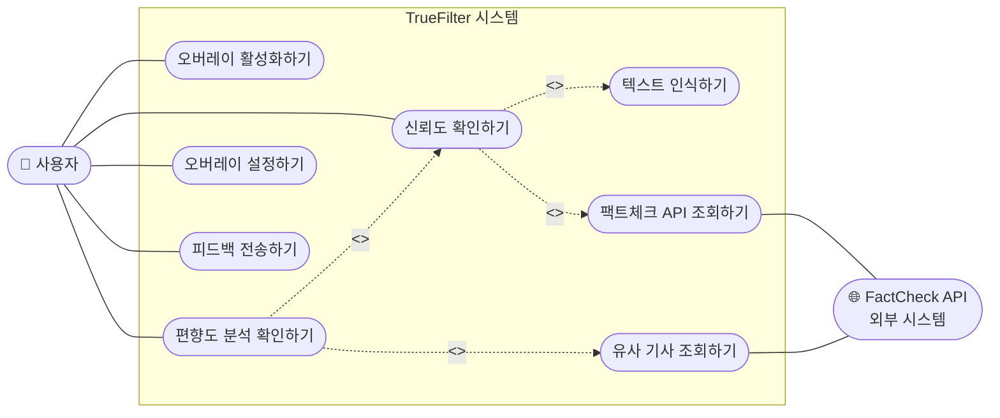

# TrueFilter — 유스케이스 다이어그램

> **작성 기준**: PHASE3-5 UML 작성 가이드 §2  
> **주 작성자**: 설계자 | **부 작성자**: 분석가 (정주승)  
> **버전**: v1.0 | **작성일**: 2026-05-11 | **마일스톤**: M2

---

## FR → 유스케이스 대응표

| FR ID | 요구사항 내용 (주체) | 유스케이스명 | 액터 |
|-------|---------------------|-------------|------|
| FR-01 | 시스템은 SNS 화면 텍스트를 실시간으로 인식할 수 있어야 한다 | 오버레이 활성화하기 | 사용자 |
| FR-02 | 시스템은 신뢰도 점수를 5단계 척도로 산출할 수 있어야 한다 | 신뢰도 확인하기 | 사용자 |
| FR-03 | 사용자는 오버레이 창의 위치와 투명도를 조절할 수 있어야 한다 | 오버레이 설정하기 | 사용자 |
| FR-04 | 시스템은 편향도 분석 결과와 유사 기사 리스트를 제공할 수 있어야 한다 | 편향도 분석 확인하기 | 사용자 |
| FR-05 | 사용자는 오분석 수정을 요청하는 피드백을 전송할 수 있어야 한다 | 피드백 전송하기 | 사용자 |

---

## 유스케이스 다이어그램

### include / extend 선택 근거

| 관계 | 대상 | 근거 |
|------|------|------|
| `<<include>>` | UC02 → 텍스트 인식하기 | 신뢰도 분석은 텍스트 인식이 반드시 선행되어야 실행 가능 (FR-01 의존) |
| `<<include>>` | UC02 → 팩트체크 API 조회하기 | 신뢰도 점수 계산에 외부 팩트체크 데이터가 항상 필요 (FR-02) |
| `<<include>>` | UC03 → UC02 | 편향도 분석은 신뢰도 분석 결과를 반드시 포함해서 표시 (FR-04) |
| `<<extend>>` | UC03 → 유사 기사 조회하기 | 사용자가 버튼을 탭할 때만 조건부 실행 (AI 인터뷰 Q5 반영) |

---

## 유스케이스 설명서

### UC-02 신뢰도 확인하기

| 항목 | 내용 |
|------|------|
| **ID** | UC-02 |
| **Primary Actor** | 사용자 |
| **Importance Level** | High |
| **Use Case Type** | Detail, Essential |
| **Brief Description** | SNS 화면에서 뉴스 텍스트가 감지되면 출처 공신력·팩트체크·인용 여부를 합산하여 5단계 신뢰도 점수를 오버레이로 표시한다 |
| **Trigger** | SNS 앱 화면에 뉴스 텍스트(30자 이상)가 표시될 때 자동 감지 |
| **Relationships** | Include: 텍스트 인식하기, 팩트체크 API 조회하기 |

**Normal Flow of Events**

1. 사용자가 SNS 앱을 실행하여 피드를 스크롤한다.
2. TrueFilter 오버레이 서비스가 화면 텍스트를 감지하고 인식을 실행한다.
   - `<<include>>` 텍스트 인식하기: `TextRecognizer`가 뉴스 텍스트를 추출한다.
3. 시스템이 `ArticleCache`에서 동일 텍스트 해시를 조회한다.
   - [캐시 히트] → Step 5로 이동
   - [캐시 미스] → Step 4로 이동
4. `<<include>>` 팩트체크 API 조회하기: 외부 API를 호출하여 결과를 수신한다.
   - `TrustAnalyzer`가 출처 공신력(40%) + 팩트체크(40%) + 인용(20%) 가중합으로 점수 계산 후 캐시에 저장한다.
5. 시스템이 신뢰도 5단계 게이지를 오버레이로 출력한다. ← **NFR-01: 2초 이내**
6. 사용자가 오버레이를 확인한다.

**Alternative / Exceptional Flow**

| 식별자 | 예외 상황 | 처리 방식 |
|--------|-----------|-----------|
| S4-1a | FactCheck API 응답 2초 초과 | 타임아웃 후 "분석 중" 표시; 결과 도착 시 업데이트 |
| S2-1a | 인식 텍스트가 뉴스 패턴 미충족 (30자 미만) | 오버레이 미표시 |
| S4-2a | API HTTP 5xx 오류 | 출처·인용 점수만으로 부분 계산 후 "팩트체크 미포함" 표시 |

---

### UC-05 피드백 전송하기

| 항목 | 내용 |
|------|------|
| **ID** | UC-05 |
| **Primary Actor** | 사용자 |
| **Importance Level** | Low |
| **Trigger** | 사용자가 오버레이의 피드백 아이콘을 탭 |
| **Relationships** | 없음 |

**Normal Flow of Events**

1. 사용자가 오버레이의 피드백 아이콘을 탭한다.
2. 시스템이 코멘트 입력 폼을 표시한다.
3. 사용자가 내용을 입력하고 전송 버튼을 탭한다.
4. 시스템이 `FeedbackRepository.save(analysisId, comment)`를 호출한다.
5. 시스템이 "피드백이 전송되었습니다" 메시지를 1.5초 표시 후 폼을 닫는다.

**Alternative / Exceptional Flow**

| 식별자 | 예외 상황 | 처리 방식 |
|--------|-----------|-----------|
| S3-1a | 코멘트 미입력 상태 전송 시도 | 전송 버튼 비활성화, "내용을 입력해주세요" 안내 |
| S4-1a | 네트워크 오프라인 | 로컬 큐 저장 후 복구 시 자동 재전송 |

---

## 검토 체크리스트 (가이드 §2-4)

- [x] 모든 FR(5개)이 유스케이스로 표현되어 있는가?
- [x] 액터가 실제 사용자 역할과 일치하는가?
- [x] 유스케이스 이름이 "동사 + 목적어" 형식인가?
- [x] `<<include>>` / `<<extend>>` 관계가 올바르게 사용되었는가?
- [x] 시스템 경계 안에 있어야 할 기능이 밖에 있지 않은가?
- [x] NFR은 유스케이스로 표현하지 않았는가?

---

*최종 수정: 2026-05-11 | 담당: 설계자*
