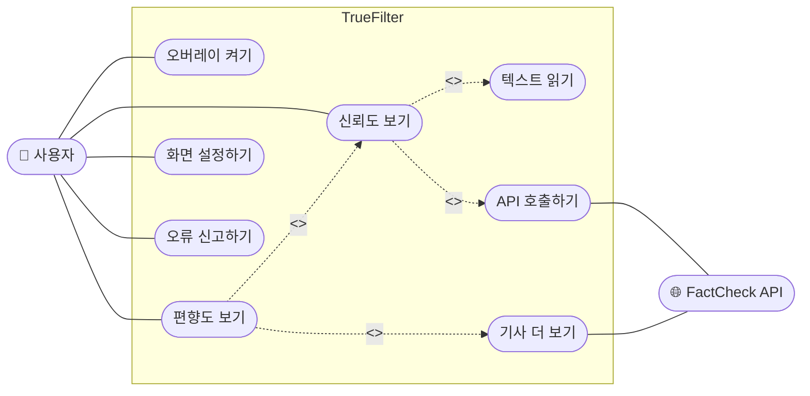

# M2 AI 활용 로그 — 유스케이스 다이어그램

> **대상 산출물**: `docs/design/usecase_diagram.md`
> **작성자**: 설계자
> **대상 기간**: 9주차 (M2 설계 착수)
> **사용 도구**: Claude (Anthropic)

---

## 건별 로그 #1 — 유스케이스 다이어그램 초안 생성

### 프롬프트

```
(파일 첨부: PHASE3-5_UML_작성가이드.pdf)
(파일 첨부: _DKU_C조_PHASE3-3_요구사항정의서.pdf)

첨부한 UML 작성 가이드 §2 형식에 맞춰서
요구사항 정의서의 FR 목록을 유스케이스 다이어그램으로 만들어줘.
Mermaid flowchart 형식으로 작성하고
액터, 시스템 경계, include/extend 관계 포함해줘.
```

---

### AI 응답 요약

Claude가 가이드 §2 형식을 대체로 잘 준수하여 `flowchart LR`, `subgraph` 시스템 경계, `<<include>>`/`<<extend>>` 표기를 모두 포함한 코드를 생성하였다. FR 5개가 유스케이스로 변환되었고 FactCheck API 액터도 포함되었다. 전체 구조는 사용 가능한 수준이었으나 세부 내용 일부가 마음에 들지 않아 수정하였다.

---

### AI 생성 원본



---

### 비판적 검토

AI가 생성한 다이어그램의 구조와 관계 표기는 가이드를 잘 따랐다. 다만 유스케이스 이름이 팀이 요구사항 정의서에서 사용한 표현과 달라서 통일성이 없었고, 시스템 경계 이름이 너무 짧게 표기되어 공식 문서로서 아쉬웠다.

| # | 검토 내용 | 판단 |
|---|----------|------|
| 1 | `flowchart LR`, `subgraph`, `<<include>>`/`<<extend>>` 등 가이드 형식 준수 여부 | 적절 |
| 2 | FR 5개 전부 유스케이스로 변환, NFR 미포함 | 적절 |
| 3 | 유스케이스 이름이 요구사항 정의서 표현과 다름 (`신뢰도 보기` vs `신뢰도 확인하기` 등) | 수정 필요 |
| 4 | 서브 유스케이스 이름이 지나치게 짧고 동사가 불명확함 (`API 호출하기`, `기사 더 보기`) | 수정 필요 |
| 5 | 시스템 경계명 `"TrueFilter"`만 표기 — 공식 문서답게 보완 필요 | 수정 필요 |

---

### 수정 내용

**수정 1** — 유스케이스 이름을 요구사항 정의서 표현에 맞게 통일

요구사항 정의서와 기획서에서 사용한 표현을 그대로 가져와 일관성을 맞췄다.

| AI 원본 | 수정 후 |
|---------|---------|
| `오버레이 켜기` | `오버레이 활성화하기` |
| `신뢰도 보기` | `신뢰도 확인하기` |
| `편향도 보기` | `편향도 분석 확인하기` |
| `화면 설정하기` | `오버레이 설정하기` |
| `오류 신고하기` | `피드백 전송하기` |
| `텍스트 읽기` | `텍스트 인식하기` |
| `API 호출하기` | `팩트체크 API 조회하기` |
| `기사 더 보기` | `유사 기사 조회하기` |

**수정 2** — 시스템 경계명을 `"■ TrueFilter 시스템"`으로 보완

공식 문서로서 시스템 이름을 명확하게 표기하는 것이 자연스러워 보였다.

---

### 최종 반영 결과

`docs/design/usecase_diagram.md`의 `## 유스케이스 다이어그램` 섹션에 반영 완료.  
전체 구조와 관계는 AI 원본을 그대로 사용하였고, **유스케이스 이름 8개**와 **시스템 경계명 1개**만 팀 표현으로 교체하였다.

---

## 건별 로그 #2 — 유스케이스 설명서 초안 생성

### 프롬프트

```
(파일 첨부: PHASE3-5_UML_작성가이드.pdf)
(파일 첨부: _DKU_C조_PHASE3-3_요구사항정의서.pdf)

UC-02 "신뢰도 확인하기"의 유스케이스 설명서를 작성해줘.
첨부한 가이드 §2-2 형식(식별부, 정상 시나리오, 예외 처리)으로 써줘.
요구사항 정의서의 NFR-01(2초 이내)과 FR-02(5단계 계산 방식)도 반영해줘.
```

---

### AI 응답 요약

Claude가 식별부, 정상 시나리오 6단계, 예외 처리 3개 항목을 포함한 설명서를 생성하였다. 전반적인 구조는 강의 Chap-8 유스케이스 설명서 형식과 일치하였다. 다만 예외 처리 서술이 너무 간결하여 실제로 어떻게 처리되는지 동작 방식이 빠져 있었고, NFR-01 언급 위치가 식별부에만 있고 시나리오 흐름에 연결되어 있지 않았다.

---

### AI 생성 원본 (예외 처리 부분)

| 식별자 | 예외 상황 | 처리 |
|--------|-----------|------|
| E-1 | API 응답 없음 | 오류 메시지 표시 |
| E-2 | 텍스트 인식 실패 | 오버레이 미표시 |
| E-3 | 네트워크 오류 | 재시도 안내 |

---

### 비판적 검토

| # | 검토 내용 | 판단 |
|---|----------|------|
| 1 | 식별부·정상 시나리오·예외 처리 구조 준수 | 적절 |
| 2 | 예외 처리에 구체적인 fallback 동작이 없음 (`오류 메시지 표시`만으로 어떻게 처리되는지 모름) | 수정 필요 |
| 3 | NFR-01이 식별부에만 언급되고 시나리오 Step 5와 연결되지 않음 | 수정 필요 |
| 4 | 텍스트 인식 실패의 구체적 조건 없음 (몇 자 미만인지 등) | 수정 필요 |

---

### 수정 내용

**수정 1** — 예외 처리에 fallback 동작 구체화

`오류 메시지 표시`처럼 막연한 서술 대신 실제 처리 방식을 추가하였다.

| AI 원본 | 수정 후 |
|---------|---------|
| API 응답 없음 → 오류 메시지 표시 | FactCheck API 응답 2초 초과 → 타임아웃 처리 후 "분석 중" 표시; 결과 도착 시 업데이트 |
| 텍스트 인식 실패 → 오버레이 미표시 | 인식 텍스트가 뉴스 패턴 미충족(30자 미만) → 오버레이 미표시 |
| 네트워크 오류 → 재시도 안내 | API HTTP 5xx 오류 → 출처·인용 점수만으로 부분 계산 후 "팩트체크 미포함" 표시 |

**수정 2** — 정상 시나리오 Step 5에 `← NFR-01: 2초 이내` 명시

---

### 최종 반영 결과

`docs/design/usecase_diagram.md`의 `## 유스케이스 설명서` 섹션에 반영 완료.  
구조는 AI 원본을 유지하고 **예외 처리 서술 3개**와 **시나리오 Step 5 주석**을 수정하였다.

---

*작성일: 2026-05-11 | 작성자: 설계자*
